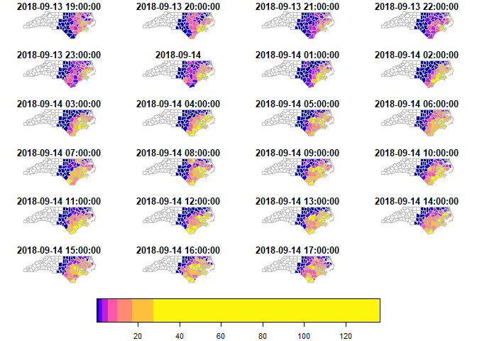

<!-- README.md is generated from README.Rmd. Please edit that file - rmarkdown::render('README.Rmd', output_format = 'github_document', output_file = 'README.md') -->
Spatiotemporal Arrays: Raster and Vector Datacubes
==================================================

[](https://travis-ci.org/r-spatial/stars) [](https://ci.appveyor.com/project/edzerpebesma/stars) [](https://codecov.io/gh/r-spatial/stars) [](https://cran.r-project.org/package=stars) [](https://cran.r-project.org/web/checks/check_results_stars.html) [](https://www.r-pkg.org/pkg/stars) [](https://CRAN.R-project.org/package=stars)

Spatiotemporal data often comes in the form of dense arrays, with space and time being array dimensions. Examples include

-   socio-economic or demographic data,
-   environmental variables monitored at fixed stations,
-   raster maps
-   time series of satellite images with multiple spectral bands,
-   spatial simulations, and
-   climate or weather model output.

This R package provides classes and methods for reading, manipulating, plotting and writing such data cubes, to the extent that there are proper formats for doing so.

Raster and vector data cubes
----------------------------

The canonical data cube most of us have in mind is that where two dimensions represent spatial raster dimensions, and the third time (or band), as e.g. shown here:


By data cubes however we also consider higher-dimensional cubes (hypercubes) such as a five-dimensional cube where in addition to time, spectral band and sensor form dimensions:


or lower-dimensional cubes such as a raster image:

``` r
suppressPackageStartupMessages(library(dplyr))
library(stars)
# Loading required package: abind
# Loading required package: sf
# Linking to GEOS 3.8.0, GDAL 3.0.2, PROJ 6.2.1
tif = system.file("tif/L7_ETMs.tif", package = "stars")
read_stars(tif) %>%
  slice(index = 1, along = "band") %>%
  plot()
```


Raster data do not need to be regular and aligned with North/East, and package `stars` supports besides *regular* also *rotated*, *sheared*, *rectilinear* and *curvilinear* rasters:


Vector data cubes arise when we do not have two regularly discretized spatial dimensions, but a single dimension indicating spatial feature geometries, such as polygons (e.g. denoting administrative regions):


or points (e.g. denoting sensor locations):


NetCDF, GDAL
------------

`stars` provides two functions to read data: `read_ncdf` and `read_stars`, where the latter reads through GDAL. (In the future, both will be integrated in `read_stars`.) For reading NetCDF files, package `RNetCDF` is used, for reading through GDAL, package `sf` provides the binary linking to GDAL.

For vector and raster operations, `stars` uses as much as possible the routines available in GDAL and PROJ (e.g. `st_transform`, `rasterize`, `polygonize`, `warp`). Read more about this in the vignette on [vector-raster conversions, reprojection, warping](https://r-spatial.github.io/stars/articles/stars5.html).

Out-of-memory (on-disk) rasters
-------------------------------

Package `stars` provides `stars_proxy` objects (currently only when read through GDAL), which contain only the dimensions metadata and pointers to the files on disk. These objects work lazily: reading and processing data is postponed to the moment that pixels are really needed (at plot time, or when writing to disk), and is done at the lowest spatial resolution possible that still fulfills the resolution of the graphics device. More details are found in the [stars proxy vignette](https://r-spatial.github.io/stars/articles/stars2.html).

The following methods are currently available for `stars_proxy` objects:

``` r
methods(class = "stars_proxy")
#  [1] [              adrop          aggregate      aperm          as.data.frame 
#  [6] c              coerce         dim            filter         initialize    
# [11] Math           merge          mutate         Ops            plot          
# [16] predict        print          pull           select         show          
# [21] slice          slotsFromS3    split          st_apply       st_as_stars   
# [26] st_crop        st_redimension write_stars   
# see '?methods' for accessing help and source code
```

Raster and vector time series analysis example
----------------------------------------------

In the following, a curvilinear grid with hourly precipitation values of a hurricane is imported and the first 12 time steps are plotted:

``` r
prec_file = system.file("nc/test_stageiv_xyt.nc", package = "stars")
(prec = read_ncdf(prec_file, curvilinear = c("lon", "lat"), ignore_bounds = TRUE))
# no 'var' specified, using Total_precipitation_surface_1_Hour_Accumulation
# other available variables:
#  time_bounds, lon, lat, time
# No projection information found in nc file. 
#  Coordinate variable units found to be degrees, 
#  assuming WGS84 Lat/Lon.
# stars object with 3 dimensions and 1 attribute
# attribute(s):
#  Total_precipitation_surface_1_Hour_Accumulation [kg/m^2]
#  Min.   :  0.000                                         
#  1st Qu.:  0.000                                         
#  Median :  0.750                                         
#  Mean   :  4.143                                         
#  3rd Qu.:  4.630                                         
#  Max.   :163.750                                         
# dimension(s):
#      from  to                  offset   delta                       refsys
# x       1  87                      NA      NA +proj=longlat +datum=WGS8...
# y       1 118                      NA      NA +proj=longlat +datum=WGS8...
# time    1  23 2018-09-13 18:30:00 UTC 1 hours                      POSIXct
#      point                         values    
# x       NA [87x118] -80.6113,...,-74.8822 [x]
# y       NA   [87x118] 32.4413,...,37.6193 [y]
# time    NA                           NULL    
# curvilinear grid
sf::read_sf(system.file("gpkg/nc.gpkg", package = "sf"), "nc.gpkg") %>%
  st_transform(st_crs(prec)) -> nc # transform from NAD27 to WGS84
nc_outline = st_union(st_geometry(nc))
plot_hook = function() plot(nc_outline, border = 'red', add = TRUE)
prec %>%
  slice(index = 1:12, along = "time") %>%
  plot(downsample = c(5, 5, 1), hook = plot_hook)
```


and next, intersected with with the counties of North Carolina, where the maximum precipitation intensity was obtained per county, and plotted:

``` r
a = aggregate(prec, by = nc, FUN = max)
# although coordinates are longitude/latitude, st_intersects assumes that they are planar
# although coordinates are longitude/latitude, st_intersects assumes that they are planar
plot(a, max.plot = 23, border = 'grey', lwd = .5)
```



We can integrate over (reduce) time, for instance to find out *when* the maximum precipitation occurred. The following code finds the time index, and then the corresponding time value:

``` r
index_max = function(x) ifelse(all(is.na(x)), NA, which.max(x))
st_apply(a, "geom", index_max) %>%
  mutate(when = st_get_dimension_values(a, "time")[.$index_max]) %>%
  select(when) %>%
  plot(key.pos = 1, main = "time of maximum precipitation")
```


Other packages for data cubes
-----------------------------

### [`gdalcubes`](https://github.com/appelmar/gdalcubes_R/)

Package `gdalcubes` can be used to create data cubes (or functions from them) from image collections, sets of multi-band images with varying

-   spatial resolution
-   spatial extent
-   coordinate reference systems (e.g., spread over multiple UTM zones)
-   observation times

and does this by resampling and/or aggregating over space and/or time. It reuses GDAL VRT's and gdalwarp for spatial resampling and/or warping, and handles temporal resampling or aggregation itself.

### [`ncdfgeom`](https://github.com/USGS-R/ncdfgeom)

`ncdfgeom` reads and writes vector data cubes from and to netcdf files in a standards-compliant way.

### [`raster`](https://github.com/rspatial/raster/)

Package `raster` is a powerful package for handling raster maps and stacks of raster maps both in memory and on disk, but does not address

-   non-raster time series,
-   multi-attribute rasters time series
-   rasters with mixed type attributes (e.g., numeric, logical, factor, POSIXct)
-   rectilinear or curvilinear rasters

A list of `stars` commands matching existing `raster` commands is found in this [wiki](https://github.com/r-spatial/stars/wiki/How-%60raster%60-functions-map-to-%60stars%60-functions). A list of translations in the opposite direction (from `stars` to `raster`) still needs to be made.

Other `stars` resources:
------------------------

-   blog posts: [first](https://r-spatial.org/r/2017/11/23/stars1.html), [second](https://www.r-spatial.org/r/2018/03/22/stars2.html), [third](https://www.r-spatial.org/r/2018/03/23/stars3.html)
-   vignettes: [first](https://r-spatial.github.io/stars/articles/stars1.html), [second](https://r-spatial.github.io/stars/articles/stars2.html), [third](https://r-spatial.github.io/stars/articles/stars3.html), [fourth](https://r-spatial.github.io/stars/articles/stars4.html), [fifth](https://r-spatial.github.io/stars/articles/stars5.html)
-   the original [R Consortium proposal](https://github.com/edzer/stars/blob/master/PROPOSAL.md).

### Acknowledgment

This project has been realized with financial [support](https://www.r-consortium.org/blog/2017/04/03/q1-2017-isc-grants) from the

<a href="https://www.r-consortium.org/projects/awarded-projects">  </a>
