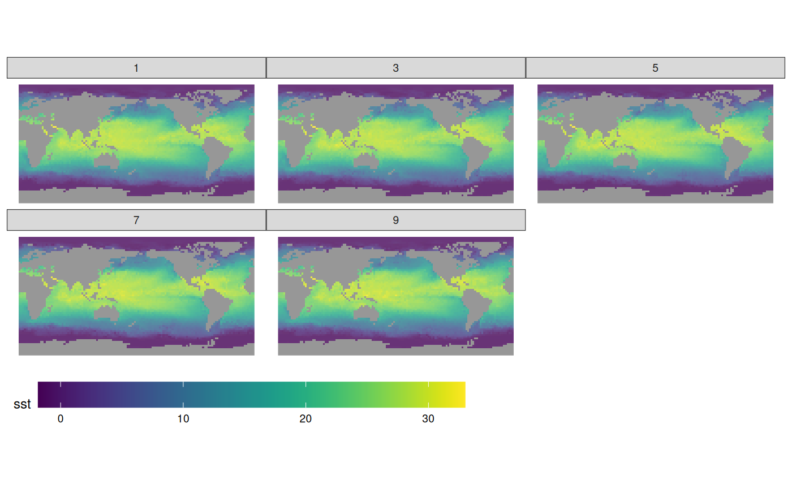
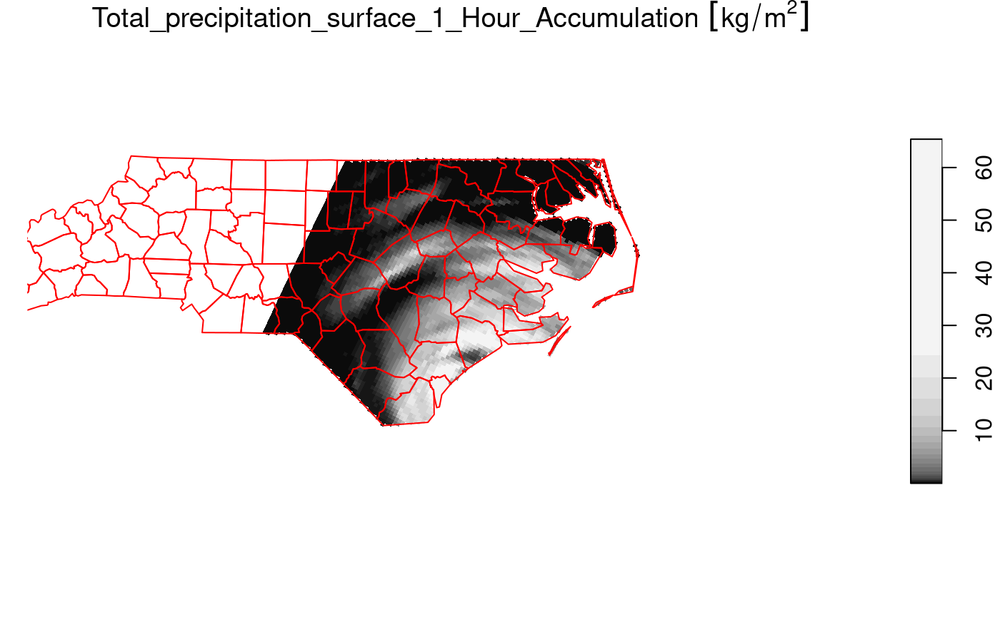
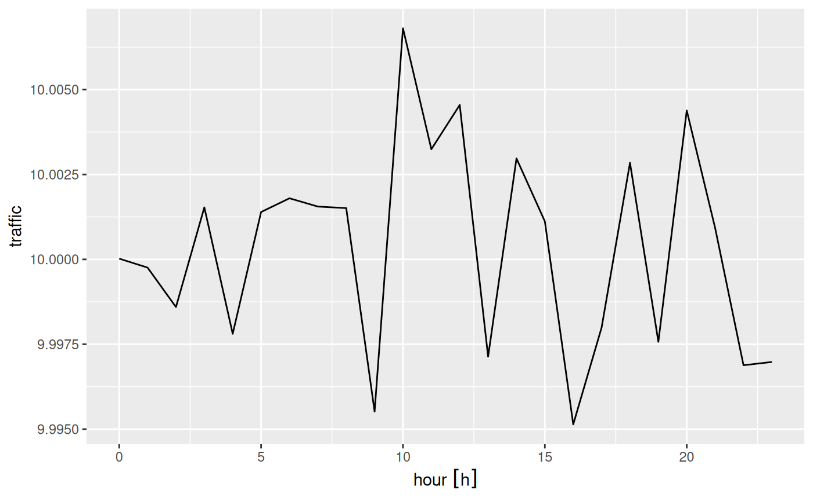
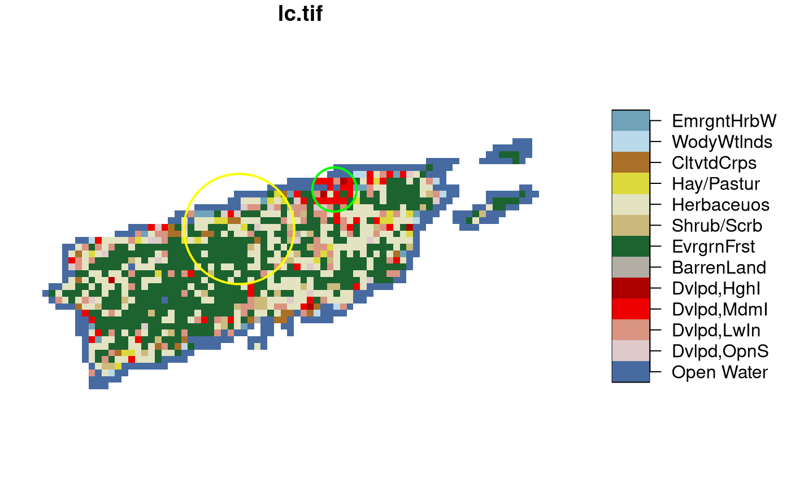

# 1. introduction

Package `stars` provides infrastructure for *data cubes*, array data
with labeled dimensions, with emphasis on arrays where some of the
dimensions relate to time and/or space.

Spatial data cubes are arrays with one or more spatial dimensions.
Raster data cubes have at least two spatial dimensions that form the
raster tesselation. Vector data cubes have at least one spatial
dimension that may for instance reflect a polygon tesselation, or a set
of point locations. Conversions between the two (rasterization,
polygonization) are provided. Vector data are represented by simple
feature geometries (packages `sf`). Tidyverse methods are provided.

The `stars` package is loaded by

``` r
library(stars)
## Loading required package: abind
## Loading required package: sf
## Linking to GEOS 3.12.1, GDAL 3.8.4, PROJ 9.4.0; sf_use_s2() is TRUE
```

Spatiotemporal arrays are stored in objects of class `stars`; methods
for class `stars` currently available are

``` r
methods(class = "stars")
##  [1] [                 [[<-              [<-               %in%             
##  [5] $<-               adrop             aggregate         aperm            
##  [9] as.data.frame     as.Date           as.POSIXct        c                
## [13] coerce            contour           cut               dim              
## [17] dimnames          dimnames<-        droplevels        expand_dimensions
## [21] hist              image             initialize        is.na            
## [25] Math              merge             Ops               plot             
## [29] prcomp            predict           print             show             
## [33] slotsFromS3       split             st_apply          st_area          
## [37] st_as_sf          st_as_sfc         st_as_stars       st_bbox          
## [41] st_coordinates    st_crop           st_crs            st_crs<-         
## [45] st_dimensions     st_dimensions<-   st_downsample     st_extract       
## [49] st_geometry       st_geotransform   st_geotransform<- st_interpolate_aw
## [53] st_intersects     st_join           st_mosaic         st_normalize     
## [57] st_redimension    st_rotate         st_sample         st_set_bbox      
## [61] st_transform      st_write          time              write_stars      
## see '?methods' for accessing help and source code
```

(tidyverse methods are only visible after loading package `tidyverse`).

## Reading a satellite image

We can read a satellite image through GDAL, e.g. from a GeoTIFF file in
the package:

``` r
tif = system.file("tif/L7_ETMs.tif", package = "stars")
x = read_stars(tif)
plot(x, axes = TRUE)
```


We see that the image is geographically referenced (has coordinate
values along axes), and that the object returned (`x`) has three
dimensions called `x`, `y` and `band`, and has one attribute:

``` r
x
## stars object with 3 dimensions and 1 attribute
## attribute(s):
##              Min. 1st Qu. Median     Mean 3rd Qu. Max.
## L7_ETMs.tif     1      54     69 68.91242      86  255
## dimension(s):
##      from  to  offset delta                     refsys point x/y
## x       1 349  288776  28.5 SIRGAS 2000 / UTM zone 25S FALSE [x]
## y       1 352 9120761 -28.5 SIRGAS 2000 / UTM zone 25S FALSE [y]
## band    1   6      NA    NA                         NA    NA
```

Each dimension has a name; the meaning of the fields of a single
dimension are:

| *field* | *meaning*                                                                  |
|---------|----------------------------------------------------------------------------|
| from    | the origin index (1)                                                       |
| to      | the final index (dim(x)\[i\])                                              |
| offset  | the start value for this dimension (pixel boundary), if regular            |
| delta   | the step (pixel, cell) size for this dimension, if regular                 |
| refsys  | the reference system, or proj4string                                       |
| point   | logical; whether cells refer to points, or intervals                       |
| values  | the sequence of values for this dimension (e.g., geometries), if irregular |

This means that for an index i (starting at $i = 1$) along a certain
dimension, the corresponding dimension value (coordinate, time) is
$\text{offset} + (i - 1) \times \text{delta}$. This value then refers to
the start (edge) of the cell or interval; in order to get the interval
middle or cell centre, one needs to add half an offset.

Dimension `band` is a simple sequence from 1 to 6. Since bands refer to
colors, one could put their wavelength values in the `values` field.

For this particular dataset (and most other raster datasets), we see
that delta for dimension `y` is negative: this means that consecutive
array values have decreasing $y$ values: cell indexes increase from top
to bottom, in the direction opposite to the $y$ axis.

`read_stars` reads all bands from a raster dataset, or optionally a
subset of raster datasets, into a single `stars` array structure. While
doing so, raster values (often UINT8 or UINT16) are converted to double
(numeric) values, and scaled back to their original values if needed if
the file encodes the scaling parameters.

The data structure `stars` is a generalization of the `tbl_cube` found
in `cubelyr`; we can convert to that by

``` r
library(cubelyr)
as.tbl_cube(x)
## Source: local array [737,088 x 3]
## D: x [dbl, 349]
## D: y [dbl, 352]
## D: band [int, 6]
## M: L7_ETMs.tif [dbl[,352,6]]
```

but this will cause a loss of certain properties (cell size, reference
system, vector geometries)

### Switching attributes to dimensions and back

``` r
(x.spl = split(x, "band"))
## stars object with 2 dimensions and 6 attributes
## attribute(s):
##     Min. 1st Qu. Median     Mean 3rd Qu. Max.
## X1    47      67     78 79.14772      89  255
## X2    32      55     66 67.57465      79  255
## X3    21      49     63 64.35886      77  255
## X4     9      52     63 59.23541      75  255
## X5     1      63     89 83.18266     112  255
## X6     1      32     60 59.97521      88  255
## dimension(s):
##   from  to  offset delta                     refsys point x/y
## x    1 349  288776  28.5 SIRGAS 2000 / UTM zone 25S FALSE [x]
## y    1 352 9120761 -28.5 SIRGAS 2000 / UTM zone 25S FALSE [y]
merge(x.spl)
## stars object with 3 dimensions and 1 attribute
## attribute(s):
##                    Min. 1st Qu. Median     Mean 3rd Qu. Max.
## X1.X2.X3.X4.X5.X6     1      54     69 68.91242      86  255
## dimension(s):
##            from  to  offset delta                     refsys point    values
## x             1 349  288776  28.5 SIRGAS 2000 / UTM zone 25S FALSE      NULL
## y             1 352 9120761 -28.5 SIRGAS 2000 / UTM zone 25S FALSE      NULL
## attributes    1   6      NA    NA                         NA    NA X1,...,X6
##            x/y
## x          [x]
## y          [y]
## attributes
```

We see that the newly created dimension lost its name, and the single
attribute got a default name. We can set attribute names with
`setNames`, and dimension names and values with `st_set_dimensions`:

``` r
merge(x.spl) |>
  setNames(names(x)) |> 
  st_set_dimensions(3, values = paste0("band", 1:6)) |>
  st_set_dimensions(names = c("x", "y", "band"))
## stars object with 3 dimensions and 1 attribute
## attribute(s):
##              Min. 1st Qu. Median     Mean 3rd Qu. Max.
## L7_ETMs.tif     1      54     69 68.91242      86  255
## dimension(s):
##      from  to  offset delta                     refsys point          values
## x       1 349  288776  28.5 SIRGAS 2000 / UTM zone 25S FALSE            NULL
## y       1 352 9120761 -28.5 SIRGAS 2000 / UTM zone 25S FALSE            NULL
## band    1   6      NA    NA                         NA    NA band1,...,band6
##      x/y
## x    [x]
## y    [y]
## band
```

### Subsetting

Besides the `tidyverse` subsetting and selection operators explained in
[this vignette](stars3.md), we can also use `[` and `[[`.

Since `stars` objects are a list of `array`s with a metadata table
describing dimensions, list extraction (and assignment) works as
expected:

``` r
class(x[[1]])
## [1] "array"
dim(x[[1]])
##    x    y band 
##  349  352    6
x$two = 2 * x[[1]]
x
## stars object with 3 dimensions and 2 attributes
## attribute(s):
##              Min. 1st Qu. Median      Mean 3rd Qu. Max.
## L7_ETMs.tif     1      54     69  68.91242      86  255
## two             2     108    138 137.82484     172  510
## dimension(s):
##      from  to  offset delta                     refsys point x/y
## x       1 349  288776  28.5 SIRGAS 2000 / UTM zone 25S FALSE [x]
## y       1 352 9120761 -28.5 SIRGAS 2000 / UTM zone 25S FALSE [y]
## band    1   6      NA    NA                         NA    NA
```

At this level, we can work with `array` objects directly.

The `stars` subset operator `[` works a bit different: its

- first argument selects attributes
- second argument selects the first dimension
- third argument selects the second dimension, etc

Thus,

``` r
x["two", 1:10, , 2:4]
## stars object with 3 dimensions and 1 attribute
## attribute(s):
##      Min. 1st Qu. Median     Mean 3rd Qu. Max.
## two    36     100    116 119.7326     136  470
## dimension(s):
##      from  to  offset delta                     refsys point x/y
## x       1  10  288776  28.5 SIRGAS 2000 / UTM zone 25S FALSE [x]
## y       1 352 9120761 -28.5 SIRGAS 2000 / UTM zone 25S FALSE [y]
## band    2   4      NA    NA                         NA    NA
```

selects the second attribute, the first 10 columns (x-coordinate), all
rows, and bands 2-4.

Alternatively, when `[` is given a single argument of class `sf`, `sfc`
or `bbox`, `[` will work as a crop operator:

``` r
circle = st_sfc(st_buffer(st_point(c(293749.5, 9115745)), 400), crs = st_crs(x))
plot(x[circle][, , , 1], reset = FALSE)
plot(circle, col = NA, border = 'red', add = TRUE, lwd = 2)
```


### Overviews

We can read rasters at a lower resolution when they contain so-called
overviews. For this GeoTIFF file, they were created with the `gdaladdo`
utility, in particular

    gdaladdo -r average L7_ETMs.tif  2 4 8 16

which adds coarse resolution versions by using the *average* resampling
method to compute values based on blocks of pixels. These can be read by

``` r
x1 = read_stars(tif, options = c("OVERVIEW_LEVEL=1"))
x2 = read_stars(tif, options = c("OVERVIEW_LEVEL=2"))
x3 = read_stars(tif, options = c("OVERVIEW_LEVEL=3"))
dim(x1)
##    x    y band 
##   88   88    6
dim(x2)
##    x    y band 
##   44   44    6
dim(x3)
##    x    y band 
##   22   22    6
par(mfrow = c(1, 3), mar = rep(0.2, 4))
image(x1[,,,1])
image(x2[,,,1])
image(x3[,,,1])
```


## Reading a raster time series: NetCDF

Another example is when we read raster time series model outputs in a
NetCDF file, e.g. by

``` r
system.file("nc/bcsd_obs_1999.nc", package = "stars") |>
    read_stars() -> w
## pr, tas,
```

We see that

``` r
w
## stars object with 3 dimensions and 2 attributes
## attribute(s):
##                 Min.   1st Qu.   Median      Mean   3rd Qu.      Max. NA's
## pr [mm/m]  0.5900000 56.139999 81.88000 101.26433 121.07250 848.54999 7116
## tas [C]   -0.4209678  8.898887 15.65763  15.48932  21.77979  29.38581 7116
## dimension(s):
##      from to offset  delta refsys                    values x/y
## x       1 81    -85  0.125     NA                      NULL [x]
## y       1 33  37.12 -0.125     NA                      NULL [y]
## time    1 12     NA     NA   Date 1999-01-31,...,1999-12-31
```

For this dataset we can see that

- variables have units associated (and a wrong unit, `C` is assigned to
  temperature)
- time is now a dimension, with proper units and time steps

Alternatively, this dataset can be read using `read_ncdf`, as in

``` r
system.file("nc/bcsd_obs_1999.nc", package = "stars") |>
    read_ncdf()
## no 'var' specified, using pr, tas
## other available variables:
##  latitude, longitude, time
## Will return stars object with 32076 cells.
## No projection information found in nc file. 
##  Coordinate variable units found to be degrees, 
##  assuming WGS84 Lat/Lon.
## stars object with 3 dimensions and 2 attributes
## attribute(s):
##                 Min.   1st Qu.   Median      Mean   3rd Qu.      Max. NA's
## pr [mm/m]  0.5900000 56.139999 81.88000 101.26433 121.07250 848.54999 7116
## tas [C]   -0.4209678  8.898887 15.65763  15.48932  21.77979  29.38581 7116
## dimension(s):
##           from to offset delta         refsys point                    values
## longitude    1 81    -85 0.125 WGS 84 (CRS84)    NA                      NULL
## latitude     1 33     33 0.125 WGS 84 (CRS84)    NA                      NULL
## time         1 12     NA    NA        POSIXct  TRUE 1999-01-31,...,1999-12-31
##           x/y
## longitude [x]
## latitude  [y]
## time
```

The difference between `read_ncdf` and `read_stars` for NetCDF files is
that the former uses package RNetCDF to directly read the NetCDF file,
where the latter uses the GDAL driver for NetCDF files.

### Reading datasets from multiple files

Model data are often spread across many files. An example of a 0.25
degree grid, global daily sea surface temperature product is found
[here](https://psl.noaa.gov/data/gridded/data.noaa.oisst.v2.highres.html);
the subset from 1981 used below was downloaded from a NOAA ftp site that
is no longer available in this form. (ftp site used to be
eclipse.ncdc.noaa.gov/pub/OI-daily-v2/NetCDF/1981/AVHRR/).

We read the data by giving `read_stars` a vector with character names:

``` r
x = c(
"avhrr-only-v2.19810901.nc",
"avhrr-only-v2.19810902.nc",
"avhrr-only-v2.19810903.nc",
"avhrr-only-v2.19810904.nc",
"avhrr-only-v2.19810905.nc",
"avhrr-only-v2.19810906.nc",
"avhrr-only-v2.19810907.nc",
"avhrr-only-v2.19810908.nc",
"avhrr-only-v2.19810909.nc"
)
# see the second vignette:
# install.packages("starsdata", repos = "https://cran.uni-muenster.de/pebesma/")
file_list = system.file(paste0("netcdf/", x), package = "starsdata")
(y = read_stars(file_list, quiet = TRUE))
## stars object with 4 dimensions and 4 attributes
## attribute(s), summary of first 1e+05 cells:
##                Min. 1st Qu. Median       Mean 3rd Qu. Max.  NA's
## sst [°*C]     -1.80   -1.19  -1.05 -0.3201670   -0.20 9.36 13360
## anom [°*C]    -4.69   -0.06   0.52  0.2299385    0.71 3.70 13360
## err [°*C]      0.11    0.30   0.30  0.2949421    0.30 0.48 13360
## ice [percent]  0.01    0.73   0.83  0.7657695    0.87 1.00 27377
## dimension(s):
##      from   to offset delta  refsys x/y
## x       1 1440      0  0.25      NA [x]
## y       1  720     90 -0.25      NA [y]
## zlev    1    1  0 [m]    NA udunits    
## time    1    9     NA    NA      NA
```

Next, we select sea surface temperature (`sst`), and drop the singular
`zlev` (depth) dimension using `adrop`:

``` r
library(dplyr)
## 
## Attaching package: 'dplyr'
## The following objects are masked from 'package:stats':
## 
##     filter, lag
## The following objects are masked from 'package:base':
## 
##     intersect, setdiff, setequal, union
library(abind)
z <- y |> select(sst) |> adrop()
```

We can now graph the sea surface temperature (SST) using `ggplot`, which
needs data in a long table form, and without units:

``` r
# convert POSIXct time to character, to please ggplot's facet_wrap()
z1 = st_set_dimensions(z, 3, values = as.character(st_get_dimension_values(z, 3)))
library(ggplot2)
library(viridis)
## Loading required package: viridisLite
library(ggthemes)
ggplot() +  
  geom_stars(data = z1[1], alpha = 0.8, downsample = c(10, 10, 1)) + 
  facet_wrap("time") +
  scale_fill_viridis() +
  coord_equal() +
  theme_map() +
  theme(legend.position = "bottom") +
  theme(legend.key.width = unit(2, "cm"))
```



## Writing stars objects to disk

We can write a stars object to disk by using `write_stars`; this used
the GDAL write engine. Writing NetCDF files without going through the
GDAL interface is currently not supported. `write_stars` currently
writes only a single attribute:

``` r
write_stars(adrop(y[1]), "sst.tif")
```

See the explanation of `merge` above to see how multiple attributes can
be merged (folded) into a dimension.

## Cropping a raster’s extent

Using a curvilinear grid, taken from the example of `read_ncdf`:

``` r
prec_file = system.file("nc/test_stageiv_xyt.nc", package = "stars")
prec = read_ncdf(prec_file, curvilinear = c("lon", "lat"))
## no 'var' specified, using Total_precipitation_surface_1_Hour_Accumulation
## other available variables:
##  lat, lon, time
## Will return stars object with 236118 cells.
## No projection information found in nc file. 
##  Coordinate variable units found to be degrees, 
##  assuming WGS84 Lat/Lon.
##plot(prec) ## gives error about unique breaks
## remove NAs, zeros, and give a large number
## of breaks (used for validating in detail)
qu_0_omit = function(x, ..., n = 22) {
  if (inherits(x, "units"))
    x = units::drop_units(na.omit(x))
  c(0, quantile(x[x > 0], seq(0, 1, length.out = n)))
}
library(dplyr) # loads slice generic
prec_slice = slice(prec, index = 17, along = "time")
plot(prec_slice, border = NA, breaks = qu_0_omit(prec_slice[[1]]), reset = FALSE)
nc = sf::read_sf(system.file("gpkg/nc.gpkg", package = "sf"), "nc.gpkg")
plot(st_geometry(nc), add = TRUE, reset = FALSE, col = NA, border = 'red')
```


We can now crop the grid to those cells falling in

``` r
nc = st_transform(nc, st_crs(prec_slice)) # datum transformation
plot(prec_slice[nc], border = NA, breaks = qu_0_omit(prec_slice[[1]]), reset = FALSE)
plot(st_geometry(nc), add = TRUE, reset = FALSE, col = NA, border = 'red')
```



The selection `prec_slice[nc]` essentially calls
`st_crop(prec_slice, nc)` to get a cropped selection. What happened here
is that all cells not intersecting with North Carolina (sea) are set to
`NA` values. For regular grids, the extent of the resulting `stars`
object is also be reduced (cropped) by default; this can be controlled
with the `crop` parameter to `st_crop` and `[.stars`.

## Vector data cube example

Like `tbl_cube`, `stars` arrays have no limits to the number of
dimensions they handle. An example is the origin-destination (OD)
matrix, by time and travel mode.

### OD: space x space x travel mode x time x time

We create a 5-dimensional matrix of traffic between regions, by day, by
time of day, and by travel mode. Having day and time of day each as
dimension is an advantage when we want to compute patterns over the day,
for a certain period.

``` r
nc = st_read(system.file("gpkg/nc.gpkg", package="sf")) 
## Reading layer `nc.gpkg' from data source 
##   `/home/runner/work/_temp/Library/sf/gpkg/nc.gpkg' using driver `GPKG'
## Simple feature collection with 100 features and 14 fields
## Geometry type: MULTIPOLYGON
## Dimension:     XY
## Bounding box:  xmin: -84.32385 ymin: 33.88199 xmax: -75.45698 ymax: 36.58965
## Geodetic CRS:  NAD27
to = from = st_geometry(nc) # 100 polygons: O and D regions
mode = c("car", "bike", "foot") # travel mode
day = 1:100 # arbitrary
library(units)
## udunits database from /usr/share/xml/udunits/udunits2.xml
units(day) = as_units("days since 2015-01-01")
hour = set_units(0:23, h) # hour of day
dims = st_dimensions(origin = from, destination = to, mode = mode, day = day, hour = hour)
(n = dim(dims))
##      origin destination        mode         day        hour 
##         100         100           3         100          24
traffic = array(rpois(prod(n), 10), dim = n) # simulated traffic counts
(st = st_as_stars(list(traffic = traffic),  dimensions = dims))
## stars object with 5 dimensions and 1 attribute
## attribute(s), summary of first 1e+05 cells:
##          Min. 1st Qu. Median    Mean 3rd Qu. Max.
## traffic     0       8     10 9.99961      12   26
## dimension(s):
##             from  to                    offset                     delta
## origin         1 100                        NA                        NA
## destination    1 100                        NA                        NA
## mode           1   3                        NA                        NA
## day            1 100 1 [days since 2015-01-01] 1 [days since 2015-01-01]
## hour           1  24                     0 [h]                     1 [h]
##              refsys point
## origin        NAD27 FALSE
## destination   NAD27 FALSE
## mode             NA FALSE
## day         udunits FALSE
## hour        udunits FALSE
##                                                                    values
## origin      MULTIPOLYGON (((-81.47276...,...,MULTIPOLYGON (((-78.65572...
## destination MULTIPOLYGON (((-81.47276...,...,MULTIPOLYGON (((-78.65572...
## mode                                                     car , bike, foot
## day                                                                  NULL
## hour                                                                 NULL
```

This array contains the simple feature geometries of origin and
destination so that we can directly plot every slice without additional
table joins. If we want to represent such an array as a `tbl_cube`, the
simple feature geometry dimensions need to be replaced by indexes:

``` r
st |> as.tbl_cube()
## Source: local array [72,000,000 x 5]
## D: origin [int, 100]
## D: destination [int, 100]
## D: mode [chr, 3]
## D: day [[days since 2015-01-01], 100]
## D: hour [[h], 24]
## M: traffic [int[,100,3,100,24]]
```

The following demonstrates how we can use `dplyr` to filter travel mode
`bike`, and compute mean bike traffic by hour of day:

``` r
b <- st |> 
  as.tbl_cube() |> 
  filter(mode == "bike") |> 
  group_by(hour) |>
  summarise(traffic = mean(traffic)) |> 
  as.data.frame()
require(ggforce) # for plotting a units variable
## Loading required package: ggforce
ggplot() +  
  geom_line(data = b, aes(x = hour, y = traffic))
```



## Extracting at point locations, aggregating over polygons

Data cube values at point location can be extracted by `st_extract`, an
example is found in [vignette 7](stars7.md)

Aggregates, such as mean, maximum or modal values can be obtained by
`aggregate`. In this example we use a categorical raster, and try to
find the modal (most frequent) class within two circular polygons:

``` r
s = system.file("tif/lc.tif", package = "stars")
r = read_stars(s, proxy = FALSE) |> droplevels()
levels(r[[1]]) = abbreviate(levels(r[[1]]), 10) # shorten text labels
st_point(c(3190631, 3125)) |> st_sfc(crs = st_crs(r)) |> st_buffer(25000) -> pol1
st_point(c(3233847, 21027)) |> st_sfc(crs = st_crs(r)) |> st_buffer(10000) -> pol2
if (isTRUE(dev.capabilities()$rasterImage == "yes")) {
  plot(r, reset = FALSE, key.pos = 4)
  plot(c(pol1, pol2), col = NA, border = c('yellow', 'green'), lwd = 2, add = TRUE)
}
```



To find the modal value, we need a function that gives back the label
corresponding to the class which is most frequent, using `table`:

``` r
f = function(x) { tb = table(x); names(tb)[which.max(tb)] }
```

We can then call `aggregate` on the raster map, and the set of the two
circular polygons `pol1` and `pol2`, and pass the function `f`:

``` r
aggregate(r, c(pol1, pol2), f) |> st_as_sf()
## Simple feature collection with 2 features and 1 field
## Geometry type: POLYGON
## Dimension:     XY
## Bounding box:  xmin: 3165631 ymin: -21875 xmax: 3243847 ymax: 31027
## Projected CRS: Albers Conical Equal Area
##       lc.tif                       geometry
## 1 EvrgrnFrst POLYGON ((3215631 3125, 321...
## 2 Dvlpd,MdmI POLYGON ((3243847 21027, 32...
```
