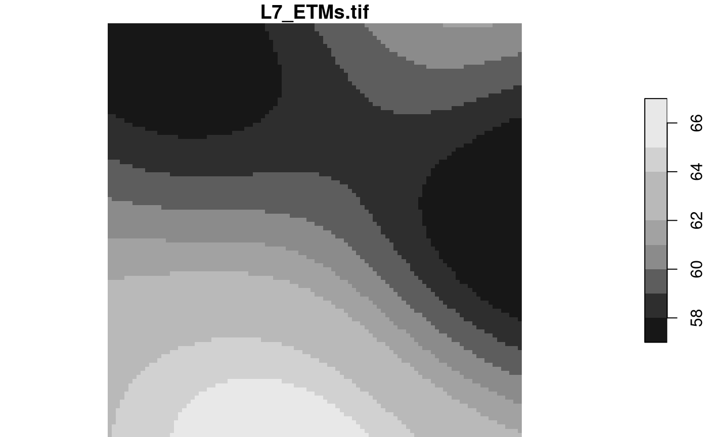
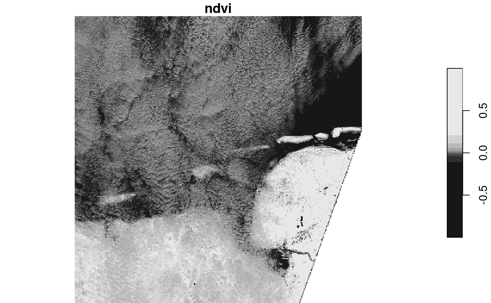
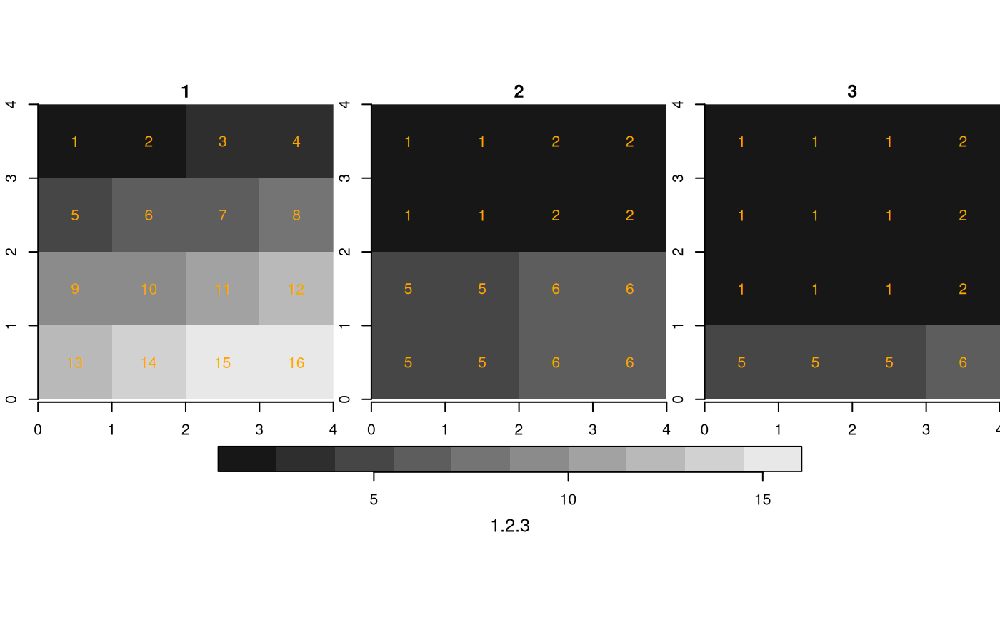
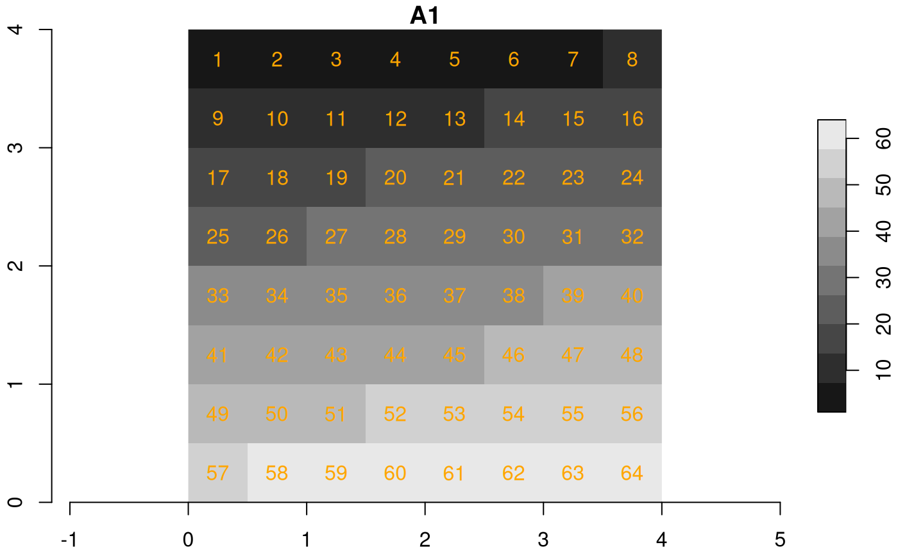
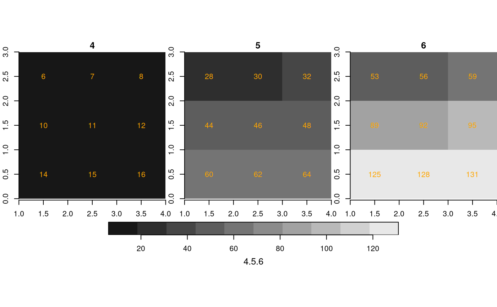

# 2. stars proxy objects

When your imagery or array data easily fits a couple of times in R’s
working memory (RAM), consider yourself lucky. This document was not
written for you. If your imagery is too large, or for other reasons you
want to work with smaller chunks of data than the files in which they
come, read on about your options. First, we will discuss the low-level
interface for this, then the higher level, using stars proxy objects
that delay all reading.

## Preamble: the starsdata package

To run all of the examples in this vignette, you must install a package
with datasets that are too large (1 Gb) to be held in the `stars`
package. They are in a [drat
repo](https://github.com/eddelbuettel/drat), installation is done by

``` r
install.packages("starsdata", repos = "https://cran.uni-muenster.de/pebesma/")
# possibly after: options(timeout = 100)
# or from an alternative repository:
# install.packages("starsdata", repos = "http://pebesma.staff.ifgi.de", type = "source")
```

## Reading chunks, change resolution, select bands

`read_stars` has an argument called `RasterIO` which controls how a GDAL
dataset is being read. By default, all pixels and all bands are read in
memory. This can consume a lot of time and require a lot of memory.
Remember that your file may be compressed, and that pixel values
represented in the file by bytes are converted to 8-byte doubles in R.

The reason for using `RasterIO` for this is that the parameters we use
are directly mapped to the GDAL RasterIO function used (after adapting
the 1-based offset index in R to 0-based offset in C++).

### Reading a particular chunk

An example of using `RasterIO` is

``` r
library(stars)
## Loading required package: abind
## Loading required package: sf
## Linking to GEOS 3.12.1, GDAL 3.8.4, PROJ 9.4.0; sf_use_s2() is TRUE
tif = system.file("tif/L7_ETMs.tif", package = "stars")
rasterio = list(nXOff = 6, nYOff = 6, nXSize = 100, nYSize = 100, bands = c(1, 3, 4))
(x = read_stars(tif, RasterIO = rasterio))
## stars object with 3 dimensions and 1 attribute
## attribute(s):
##              Min. 1st Qu. Median     Mean 3rd Qu. Max.
## L7_ETMs.tif    23      54     63 62.05977   73.25  235
## dimension(s):
##      from  to  offset delta                     refsys point x/y
## x       6 105  288776  28.5 SIRGAS 2000 / UTM zone 25S FALSE [x]
## y       6 105 9120761 -28.5 SIRGAS 2000 / UTM zone 25S FALSE [y]
## band    1   3      NA    NA                         NA    NA
dim(x)
##    x    y band 
##  100  100    3
```

Compare this to

``` r
st_dimensions(read_stars(tif))
##      from  to  offset delta                     refsys point x/y
## x       1 349  288776  28.5 SIRGAS 2000 / UTM zone 25S FALSE [x]
## y       1 352 9120761 -28.5 SIRGAS 2000 / UTM zone 25S FALSE [y]
## band    1   6      NA    NA                         NA    NA
```

and we see that

- the `delta` values remain the same,
- the offset (x/y coordinates of origin) of the grid remain the same
- the `from` and `to` reflect the new area, and relate to the new
  `delta` values
- `dim(x)` reflects the new size, and
- only three bands were read

### Reading at a different resolution

Reading datasets at a lower (but also higher!) resolution can be done by
setting `nBufXSize` and `nBufYSize`

``` r
rasterio = list(nXOff = 6, nYOff = 6, nXSize = 100, nYSize = 100,
                nBufXSize = 20, nBufYSize = 20, bands = c(1, 3, 4))
(x = read_stars(tif, RasterIO = rasterio))
## stars object with 3 dimensions and 1 attribute
## attribute(s):
##              Min. 1st Qu. Median     Mean 3rd Qu. Max.
## L7_ETMs.tif    27      53     63 62.09417      74  151
## dimension(s):
##      from to  offset  delta                     refsys point x/y
## x       2 21  288776  142.5 SIRGAS 2000 / UTM zone 25S FALSE [x]
## y       2 21 9120761 -142.5 SIRGAS 2000 / UTM zone 25S FALSE [y]
## band    1  3      NA     NA                         NA    NA
```

and we see that in addition:

- the `delta` (raster cell size) values have increased a factor 5,
  because `nBufXSize` and `nBufYSize` were set to values a factor 5
  smaller than `nXSize` and `nYSize`
- the offset coordinates of the grid are still the same
- the `from` and `to` reflect the new area, but relate to the new
  `delta` cell size values

We can also read at higher resolution; here we read a 3 x 3 area and
blow it up to 100 x 100:

``` r
rasterio = list(nXOff = 6, nYOff = 6, nXSize = 3, nYSize = 3,
   nBufXSize = 100, nBufYSize = 100, bands = 1)
x = read_stars(tif, RasterIO = rasterio)
dim(x)
##   x   y 
## 100 100
plot(x)
```


The reason we “see” only three grid cells is that the default sampling
method is “nearest neighbour”. We can modify this by

``` r
rasterio = list(nXOff = 6, nYOff = 6, nXSize = 3, nYSize = 3,
   nBufXSize = 100, nBufYSize = 100, bands = 1, resample = "cubic_spline")
x = read_stars(tif, RasterIO = rasterio)
dim(x)
##   x   y 
## 100 100
plot(x)
```



The following methods are allowed for parameter `resample`:

| `resample`          | method used                                                                 |
|---------------------|-----------------------------------------------------------------------------|
| `nearest_neighbour` | Nearest neighbour (default)                                                 |
| `bilinear`          | Bilinear (2x2 kernel)                                                       |
| `cubic`             | Cubic Convolution Approximation (4x4 kernel)                                |
| `cubic_spline`      | Cubic B-Spline Approximation (4x4 kernel)                                   |
| `lanczos`           | Lanczos windowed sinc interpolation (6x6 kernel)                            |
| `average`           | Average                                                                     |
| `mode`              | Mode (selects the value which appears most often of all the sampled points) |
| `Gauss`             | Gauss blurring                                                              |

All these methods are implemented in GDAL; for what these methods
exactly do, we refer to the GDAL documentation or source code.

## Stars proxy objects

Stars proxy objects take another approach: upon creation they contain no
data at all, but only pointers to where the data can be read. Data is
only read when it is needed, and only as much as is needed: if we plot a
proxy objects, the data are read at the resolution of pixels on the
screen, rather than at the native resolution, so that if we have e.g. a
10000 x 10000 Sentinel 2 (level 1C) image, we can open it by

``` r
granule = system.file("sentinel/S2A_MSIL1C_20180220T105051_N0206_R051_T32ULE_20180221T134037.zip", package = "starsdata")
s2 = paste0("SENTINEL2_L1C:/vsizip/", granule, "/S2A_MSIL1C_20180220T105051_N0206_R051_T32ULE_20180221T134037.SAFE/MTD_MSIL1C.xml:10m:EPSG_32632")
(p = read_stars(s2, proxy = TRUE))
## stars_proxy object with 1 attribute in 1 file(s):
## $EPSG_32632
## [1] "[...]/MTD_MSIL1C.xml:10m:EPSG_32632"
## 
## dimension(s):
##      from    to offset delta                refsys    values x/y
## x       1 10980  3e+05    10 WGS 84 / UTM zone 32N      NULL [x]
## y       1 10980  6e+06   -10 WGS 84 / UTM zone 32N      NULL [y]
## band    1     4     NA    NA                    NA B4,...,B8
```

and this happens *instantly*, because no data is read. When we plot this
object,

``` r
system.time(plot(p))
## downsample set to 18
```


    ##    user  system elapsed 
    ##   1.017   0.149   0.645

This takes only around 1 second, since only those pixels are read that
can be seen on the plot. If we read the entire image in memory first, as
we would do with

``` r
p = read_stars(s2, proxy = FALSE)
```

then only the reading would take over a minute, and require 5 Gb memory.

### Methods for stars proxy objects

``` r
methods(class = "stars_proxy")
##  [1] [               [[<-            [<-             adrop          
##  [5] aggregate       aperm           as.data.frame   c              
##  [9] coerce          dim             droplevels      hist           
## [13] image           initialize      is.na           Math           
## [17] merge           Ops             plot            prcomp         
## [21] predict         print           show            slotsFromS3    
## [25] split           st_apply        st_as_sf        st_as_stars    
## [29] st_crop         st_dimensions<- st_downsample   st_mosaic      
## [33] st_normalize    st_redimension  st_sample       st_set_bbox    
## [37] write_stars    
## see '?methods' for accessing help and source code
```

### Select attributes

We can select attributes as with regular `stars` objects, by using the
first argument to `[`:

``` r
x = c("avhrr-only-v2.19810901.nc",
"avhrr-only-v2.19810902.nc",
"avhrr-only-v2.19810903.nc",
"avhrr-only-v2.19810904.nc",
"avhrr-only-v2.19810905.nc",
"avhrr-only-v2.19810906.nc",
"avhrr-only-v2.19810907.nc",
"avhrr-only-v2.19810908.nc",
"avhrr-only-v2.19810909.nc")
file_list = system.file(paste0("netcdf/", x), package = "starsdata")
y = read_stars(file_list, quiet = TRUE, proxy = TRUE)
names(y)
## [1] "sst"  "anom" "err"  "ice"
y["sst"]
## stars_proxy object with 1 attribute in 9 file(s):
## $sst
## [1] "[...]/avhrr-only-v2.19810901.nc:sst" "[...]/avhrr-only-v2.19810902.nc:sst"
## [3] "[...]/avhrr-only-v2.19810903.nc:sst" "[...]/avhrr-only-v2.19810904.nc:sst"
## [5] "[...]/avhrr-only-v2.19810905.nc:sst" "[...]/avhrr-only-v2.19810906.nc:sst"
## [7] "[...]/avhrr-only-v2.19810907.nc:sst" "[...]/avhrr-only-v2.19810908.nc:sst"
## [9] "[...]/avhrr-only-v2.19810909.nc:sst"
## 
## dimension(s):
##      from   to offset delta  refsys x/y
## x       1 1440      0  0.25      NA [x]
## y       1  720     90 -0.25      NA [y]
## zlev    1    1  0 [m]    NA udunits    
## time    1    9     NA    NA      NA
```

Note that this selection limits the reading from 4 to 1 subdataset from
all 9 NetCDF files.

### Select an area

Another possibility is to crop, or select a rectangular region based on
a spatial object. This can be done by passing a `bbox` object, or an
`sf`, `sfc` or `stars` object from which the bounding box will be taken.
An example:

``` r
bb = st_bbox(c(xmin = 10.125, ymin = 0.125, xmax = 70.125, ymax = 70.125))
ysub = y[bb]
st_dimensions(ysub)
##      from  to offset delta  refsys x/y
## x      41 281      0  0.25      NA [x]
## y      80 360     90 -0.25      NA [y]
## zlev    1   1  0 [m]    NA udunits    
## time    1   9     NA    NA      NA
class(ysub) # still no data here!!
## [1] "stars_proxy" "stars"
plot(ysub, reset = FALSE) # plot reads the data, at resolution that is relevant
plot(st_as_sfc(bb), add = TRUE, lwd = .5, border = 'red')
```


### Lazy evaluation, changing evaluation order

Some other actions can be carried out on `stars_proxy` objects, but
their effect is delayed until the data are actually needed (`plot`,
`write_stars`). For instance, range selections on dimensions other than
shown above first need data, and can only then be carried out. Such
functions are added to the object, in an attribute called `call_list`:

``` r
yy = adrop(y)
yyy = yy[,1:10,1:10,]
class(yyy) # still no data
## [1] "stars_proxy" "stars"
st_dimensions(yyy) # and dimensions not adjusted
##      from   to offset delta  refsys x/y
## x       1 1440      0  0.25      NA [x]
## y       1  720     90 -0.25      NA [y]
## zlev    1    1  0 [m]    NA udunits    
## time    1    9     NA    NA      NA
attr(yyy, "call_list") # the name of object in the call (y) is replaced with x:
## [[1]]
## adrop(x = x, drop = drop)
## attr(,".Environment")
## <environment: 0x556c727d5988>
## 
## [[2]]
## x[i = i, 1:10, 1:10, , drop = drop, crop = crop]
## attr(,".Environment")
## <environment: 0x556c715a5050>
```

Doing this allows for optimizing the order in which operations are done.
As an example, for `st_apply`, reading can be done sequentially over the
dimensions over which the function is applied:

- If for example a function is applied to each band (such as: compute
  band quantiles), bands can be read sequentially, and discarded after
  the quantiles have been computed.
- If a time series function is applied to pixel time series and the
  result is plotted on a map, the time series function is only evaluated
  on the pixels actually plotted. This means that e.g. in

``` r
plot(st_apply(x, c("x", "y"), range))
```

the order of evaluation is reversed: `plot` knows which pixels are going
to be shown, and controls how `x` is downsampled *before* `st_apply` is
carried out on this subset.

#### Fetching the data

Fetching the data now involves reading the whole array and then
evaluating the `call_list` on it, sequentially:

``` r
(x = st_as_stars(yyy)) # read, adrop, subset
## stars object with 3 dimensions and 4 attributes
## attribute(s):
##                Min. 1st Qu. Median       Mean 3rd Qu.  Max.
## sst [°*C]     -1.28   -1.17  -1.11 -1.1163555   -1.06 -0.95
## anom [°*C]     0.48    0.62   0.69  0.6649555    0.72  0.77
## err [°*C]      0.30    0.30   0.30  0.3000000    0.30  0.30
## ice [percent]  0.76    0.79   0.81  0.8062889    0.82  0.85
## dimension(s):
##      from to offset delta x/y
## x       1 10      0  0.25 [x]
## y       1 10     90 -0.25 [y]
## time    1  9     NA    NA
```

#### Plotting with changed evaluation order

For the Sentinel 2 data, band 4 represents NIR and band 1 red, so we can
compute NDVI by

``` r
# S2 10m: band 4: near infrared, band 1: red.
#ndvi = function(x) (x[4] - x[1])/(x[4] + x[1])
ndvi = function(x1, x2, x3, x4) (x4 - x1)/(x4 + x1)
rm(x)
(s2.ndvi = st_apply(p, c("x", "y"), ndvi))
## stars_proxy object with 1 attribute in 1 file(s):
## $EPSG_32632
## [1] "[...]/MTD_MSIL1C.xml:10m:EPSG_32632"
## 
## dimension(s):
##      from    to offset delta                refsys    values x/y
## x       1 10980  3e+05    10 WGS 84 / UTM zone 32N      NULL [x]
## y       1 10980  6e+06   -10 WGS 84 / UTM zone 32N      NULL [y]
## band    1     4     NA    NA                    NA B4,...,B8    
## call_list:
## [[1]]
## st_apply(X = X, MARGIN = MARGIN, FUN = FUN, CLUSTER = CLUSTER, 
##     PROGRESS = PROGRESS, FUTURE = FUTURE, rename = rename, .fname = .fname)
## attr(,".Environment")
## <environment: 0x556c72c80c48>
## 
## This object has pending lazy operations: dimensions as printed may not reflect this.
system.time(plot(s2.ndvi)) # read - compute ndvi - plot 
## downsample set to 18
```



    ##    user  system elapsed 
    ##   0.718   0.152   0.355

## Multi-resolution proxy objects

This sections shows some examples how `stars_proxy` objects deal with
the situation where the different maps have dissimilar resolution. The
assumptions here are:

- all maps need to have the same origin coordinates (typically
  upper-left corner) and CRS.
- the first map determines the “working” resolution, to which
  e.g. native or downsampled resolutions refer

We’ll create four maps with cells size 1, 2 and 3:

``` r
s1 = st_as_stars(matrix(1:16, 4))
s2 = st_as_stars(matrix(1:16, 4))
s3 = st_as_stars(matrix(1:16, 4))
attr(s1, "dimensions")$X1$offset = 0
attr(s1, "dimensions")$X2$offset = 4
attr(s2, "dimensions")$X1$offset = 0
attr(s2, "dimensions")$X2$offset = 4
attr(s3, "dimensions")$X1$offset = 0
attr(s3, "dimensions")$X2$offset = 4
attr(s1, "dimensions")$X1$delta =  1
attr(s1, "dimensions")$X2$delta = -1
attr(s2, "dimensions")$X1$delta =  2
attr(s2, "dimensions")$X2$delta = -2
attr(s3, "dimensions")$X1$delta =  3
attr(s3, "dimensions")$X2$delta = -3
plot(s1, axes = TRUE, text_values = TRUE, text_color = 'orange')
```


``` r
plot(s2, axes = TRUE, text_values = TRUE, text_color = 'orange')
```


``` r
plot(s3, axes = TRUE, text_values = TRUE, text_color = 'orange')
```


We created three rasters with identical cell values and dimensions, but
different cell sizes, and hence extents. If we bind them in a single
proxy object, with

``` r
fn1 = paste0(tempdir(), .Platform$file.sep, "img1.tif")
fn2 = paste0(tempdir(), .Platform$file.sep, "img2.tif")
fn3 = paste0(tempdir(), .Platform$file.sep, "img3.tif")
write_stars(s1, fn1)
write_stars(s2, fn2)
write_stars(s3, fn3) 
(r1 = read_stars(c(fn1, fn2, fn3), proxy = TRUE))
## multi-resolution stars_proxy object with 3 attributes in 3 file(s):
## $`1`
## [1] "[...]/img1.tif"
## 
## $`2`
## [1] "[...]/img2.tif"
## 
## $`3`
## [1] "[...]/img3.tif"
## 
## dimension(s):
##   from to offset delta x/y
## x    1  4      0     1 [x]
## y    1  4      4    -1 [y]
```

We see that **multi-resolution** is mentioned in the printed summary.
When converting this to a `stars` object, the secondary rasters are
resampled to the cellsize + extent of the first:

``` r
st_as_stars(r1) %>%
  merge() %>%
  plot(breaks = "equal", text_values = TRUE, text_color = 'orange', axes = TRUE)
```



If we do this for a sub-range, defined for the object resolutions, we
get:

``` r
st_as_stars(r1[,2:4,2:4]) %>%
  merge() %>%
  plot(breaks = "equal", text_values = TRUE, text_color = 'orange', axes = TRUE)
```


We now create four maps, all over the same region (\[0,4\] x \[0,4\]),
with different resolutions (cell size 1, 1/2 and 1/3):

``` r
s4 = st_as_stars(matrix(1: 16, 4))
s5 = st_as_stars(matrix(1: 64, 8))
s6 = st_as_stars(matrix(1:144,12))
attr(s4, "dimensions")$X1$offset = 0
attr(s4, "dimensions")$X2$offset = 4
attr(s5, "dimensions")$X1$offset = 0
attr(s5, "dimensions")$X2$offset = 4
attr(s6, "dimensions")$X1$offset = 0
attr(s6, "dimensions")$X2$offset = 4
attr(s4, "dimensions")$X1$delta =  1
attr(s4, "dimensions")$X2$delta = -1
attr(s5, "dimensions")$X1$delta =  1/2
attr(s5, "dimensions")$X2$delta = -1/2
attr(s6, "dimensions")$X1$delta =  1/3
attr(s6, "dimensions")$X2$delta = -1/3
plot(s4, axes = TRUE, text_values = TRUE, text_color = 'orange')
```


``` r
plot(s5, axes = TRUE, text_values = TRUE, text_color = 'orange')
```



``` r
plot(s6, axes = TRUE, text_values = TRUE, text_color = 'orange')
```


``` r
fn4 = paste0(tempdir(), .Platform$file.sep, "img4.tif")
fn5 = paste0(tempdir(), .Platform$file.sep, "img5.tif")
fn6 = paste0(tempdir(), .Platform$file.sep, "img6.tif")
write_stars(s4, fn4)
write_stars(s5, fn5)
write_stars(s6, fn6) 
(r2 = read_stars(c(fn4, fn5, fn6), proxy = TRUE))
## multi-resolution stars_proxy object with 3 attributes in 3 file(s):
## $`4`
## [1] "[...]/img4.tif"
## 
## $`5`
## [1] "[...]/img5.tif"
## 
## $`6`
## [1] "[...]/img6.tif"
## 
## dimension(s):
##   from to offset delta x/y
## x    1  4      0     1 [x]
## y    1  4      4    -1 [y]

st_as_stars(r2) %>%
  merge() %>%
  plot(breaks = "equal", text_values = TRUE, text_color = 'orange', axes = TRUE)
```


``` r
st_as_stars(r2[,2:4,2:4]) %>%
  merge() %>%
  plot(breaks = "equal", text_values = TRUE, text_color = 'orange', axes = TRUE)
```



Finally, an example where the first raster has the higher resolution:

``` r
(r3 = read_stars(c(fn6, fn5, fn4), proxy = TRUE))
## multi-resolution stars_proxy object with 3 attributes in 3 file(s):
## $`6`
## [1] "[...]/img6.tif"
## 
## $`5`
## [1] "[...]/img5.tif"
## 
## $`4`
## [1] "[...]/img4.tif"
## 
## dimension(s):
##   from to offset   delta x/y
## x    1 12      0  0.3333 [x]
## y    1 12      4 -0.3333 [y]

st_as_stars(r3) %>%
  merge() %>%
  plot(breaks = "equal", text_values = TRUE, text_color = 'orange', axes = TRUE)
```


``` r
st_as_stars(r3[,2:6,3:6]) %>%
  merge() %>%
  plot(breaks = "equal", text_values = TRUE, text_color = 'orange', axes = TRUE)
```


