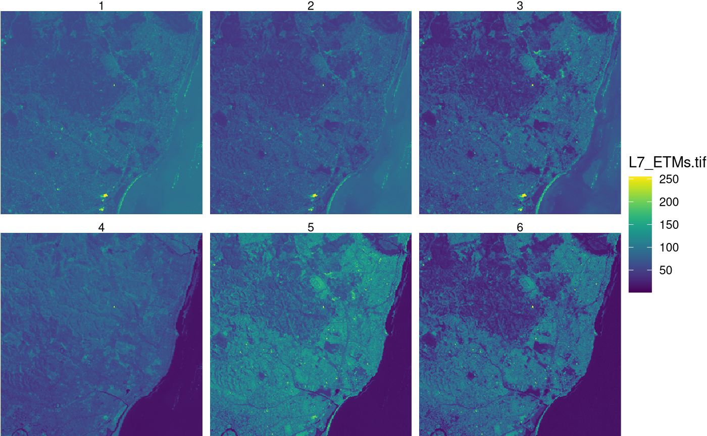

# 3. stars tidyverse methods

This vignette shows how some of the tidyverse verbs can be used on
`stars` objects.

The `stars` and `tidyverse` packages are loaded by

``` r
library(stars)
## Loading required package: abind
## Loading required package: sf
## Linking to GEOS 3.12.1, GDAL 3.8.4, PROJ 9.4.0; sf_use_s2() is TRUE
library(dplyr)
## 
## Attaching package: 'dplyr'
## The following objects are masked from 'package:stats':
## 
##     filter, lag
## The following objects are masked from 'package:base':
## 
##     intersect, setdiff, setequal, union
```

Methods now available for class `stars` are

``` r
methods(class = "stars")
##  [1] [                 [[<-              [<-               %in%             
##  [5] $<-               adrop             aggregate         aperm            
##  [9] as_tibble         as.data.frame     as.Date           as.POSIXct       
## [13] c                 coerce            contour           cut              
## [17] dim               dimnames          dimnames<-        droplevels       
## [21] expand_dimensions filter            hist              image            
## [25] initialize        is.na             Math              merge            
## [29] mutate            Ops               plot              prcomp           
## [33] predict           print             pull              rename           
## [37] select            show              slice             slotsFromS3      
## [41] split             st_apply          st_area           st_as_sf         
## [45] st_as_sfc         st_as_stars       st_bbox           st_coordinates   
## [49] st_crop           st_crs            st_crs<-          st_dimensions    
## [53] st_dimensions<-   st_downsample     st_extract        st_geometry      
## [57] st_geotransform   st_geotransform<- st_interpolate_aw st_intersects    
## [61] st_join           st_mosaic         st_normalize      st_redimension   
## [65] st_rotate         st_sample         st_set_bbox       st_transform     
## [69] st_write          time              transmute         write_stars      
## see '?methods' for accessing help and source code
```

We will work with a three-band section of a landsat image:

``` r
system.file("tif/L7_ETMs.tif", package = "stars") %>%
    read_stars -> x
x
## stars object with 3 dimensions and 1 attribute
## attribute(s):
##              Min. 1st Qu. Median     Mean 3rd Qu. Max.
## L7_ETMs.tif     1      54     69 68.91242      86  255
## dimension(s):
##      from  to  offset delta                     refsys point x/y
## x       1 349  288776  28.5 SIRGAS 2000 / UTM zone 25S FALSE [x]
## y       1 352 9120761 -28.5 SIRGAS 2000 / UTM zone 25S FALSE [y]
## band    1   6      NA    NA                         NA    NA
```

## `slice`

`slice` slices a sub-array out of the cube; this is done by specifying
the dimension on which to act, and the slice number.

``` r
x %>% slice(band, 6) -> x6
x6
## stars object with 2 dimensions and 1 attribute
## attribute(s):
##              Min. 1st Qu. Median     Mean 3rd Qu. Max.
## L7_ETMs.tif     1      32     60 59.97521      88  255
## dimension(s):
##   from  to  offset delta                     refsys point x/y
## x    1 349  288776  28.5 SIRGAS 2000 / UTM zone 25S FALSE [x]
## y    1 352 9120761 -28.5 SIRGAS 2000 / UTM zone 25S FALSE [y]
```

It returns a lower-dimensional array if a single element is selected
along the slice dimension.

## `filter`

Similar to `slice`, `filter` selects on dimensions but evaluates their
values rather than their index: in

``` r
x %>% filter(x > 289000, x < 291000, band > 3) -> x7
x7
## stars object with 3 dimensions and 1 attribute
## attribute(s):
##              Min. 1st Qu. Median     Mean 3rd Qu. Max.
## L7_ETMs.tif     5      54     70 71.79194      88  252
## dimension(s):
##      from  to  offset delta                     refsys point x/y
## x       1  70  289004  28.5 SIRGAS 2000 / UTM zone 25S FALSE [x]
## y       1 352 9120761 -28.5 SIRGAS 2000 / UTM zone 25S FALSE [y]
## band    1   3       4     1                         NA    NA
```

the subarray is created based on the x *coordinate* values.

Note that `filter` converts the object to a `tbl_cube`, and uses the
`dplyr` `filter` method for `tbl_cube` objects. This has the limitation
that `stars` objects with rectilinear, curvilinear or simple feature
geometries cannot be handled. For such objects, using regular `[`
selection or using `st_crop` may be an alternative.

## `pull`

`pull` pulls out an array from a stars object:

``` r
x %>% pull(1) -> x8
class(x8)
## [1] "array"
dim(x8)
##    x    y band 
##  349  352    6
```

## `mutate`

``` r
x %>% mutate(band2 = 2 * L7_ETMs.tif) -> x2 
x2
## stars object with 3 dimensions and 2 attributes
## attribute(s):
##              Min. 1st Qu. Median      Mean 3rd Qu. Max.
## L7_ETMs.tif     1      54     69  68.91242      86  255
## band2           2     108    138 137.82484     172  510
## dimension(s):
##      from  to  offset delta                     refsys point x/y
## x       1 349  288776  28.5 SIRGAS 2000 / UTM zone 25S FALSE [x]
## y       1 352 9120761 -28.5 SIRGAS 2000 / UTM zone 25S FALSE [y]
## band    1   6      NA    NA                         NA    NA
```

## `select`

`select` selects an attribute, or a set of attributes:

``` r
x2 %>% select(band2) -> x9
x9
## stars object with 3 dimensions and 1 attribute
## attribute(s):
##        Min. 1st Qu. Median     Mean 3rd Qu. Max.
## band2     2     108    138 137.8248     172  510
## dimension(s):
##      from  to  offset delta                     refsys point x/y
## x       1 349  288776  28.5 SIRGAS 2000 / UTM zone 25S FALSE [x]
## y       1 352 9120761 -28.5 SIRGAS 2000 / UTM zone 25S FALSE [y]
## band    1   6      NA    NA                         NA    NA
```

## `geom_stars`

`geom_raster` is a `ggplot2` geom function that accepts `stars` objects
as its `data` argument and

- sets up the raster or vector spatial coordinates as plot dimensions,
  and the first attribute as the fill variable
- allows for downsampling (without choosing a suitable downsampling
  level)
- chooses between using `geom_raster`, `geom_rect` and `geom_sf`
  depending on whether the geometry is regular, rectilinear or has
  vector geometries

An example use is

``` r
library(ggplot2)
library(viridis)
## Loading required package: viridisLite
ggplot() + 
  geom_stars(data = x) +
  coord_equal() +
  facet_wrap(~band) +
  theme_void() +
  scale_fill_viridis() +
  scale_x_discrete(expand = c(0, 0)) +
  scale_y_discrete(expand = c(0, 0))
```


