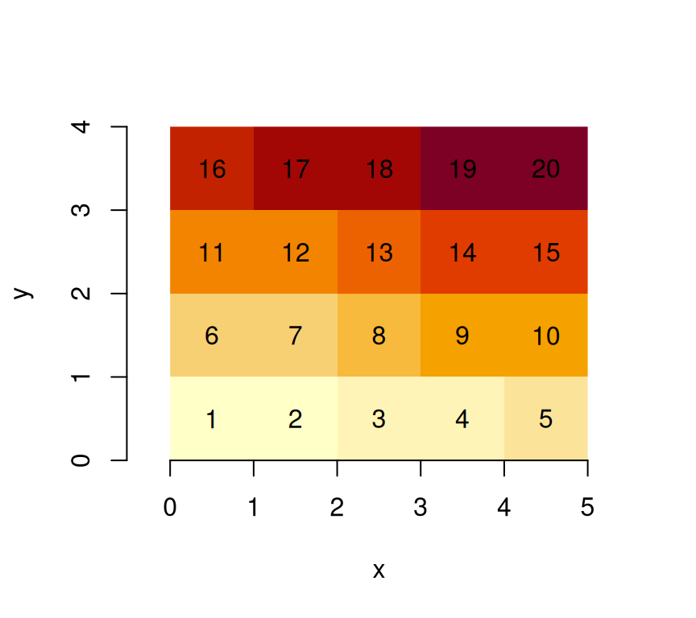
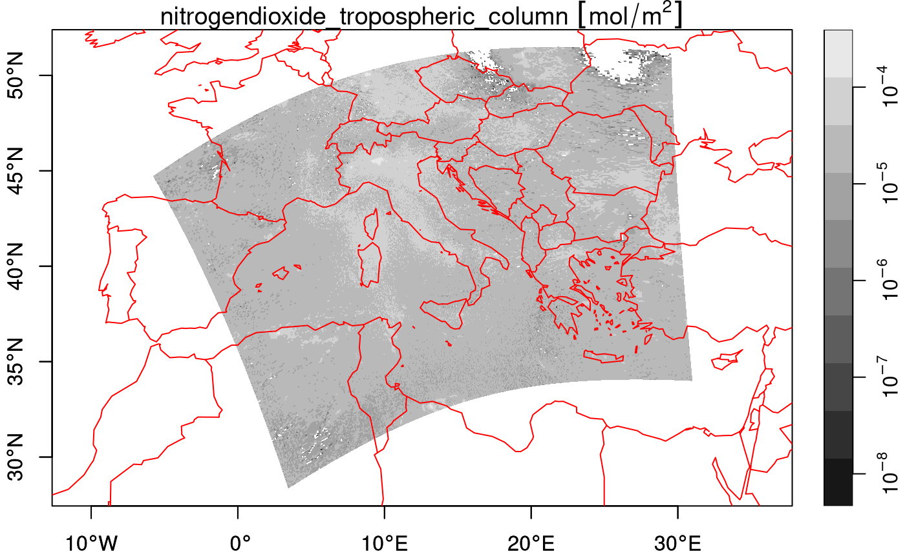
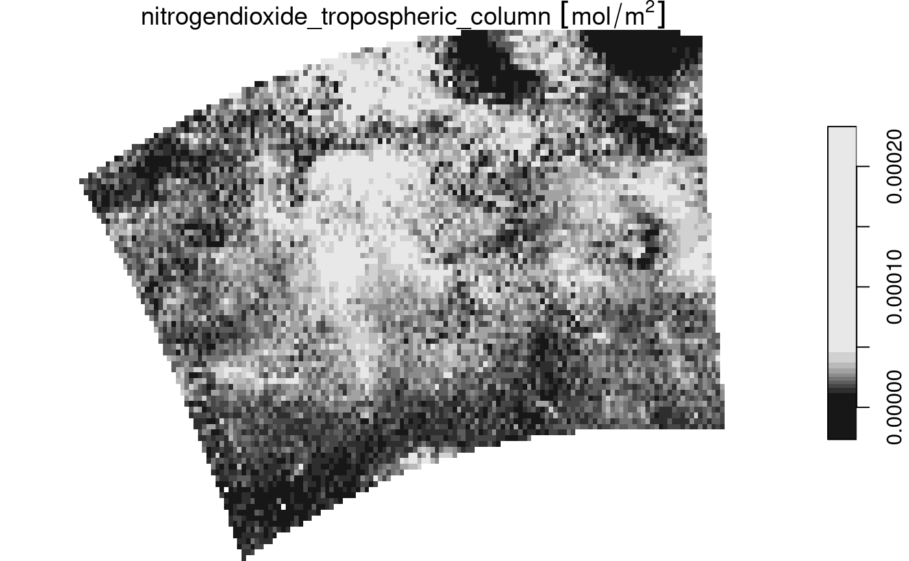

# 4. stars data model

This vignette explains the data model of `stars` objects, illustrated
using artificial and real datasets.

## Stars objects

`stars` objects consist of

- a (possibly empty) named list of arrays, each having named dimensions
  (`dim`) attribute
- an attribute called `dimensions` of class `dimensions` that carries
  dimension metadata
- a class name that includes `stars`

A `dimensions` object is a named list of `dimension` elements, each
describing the semantics a dimension of the data arrays (space, time,
type etc). In addition to that, a `dimensions` object has an attribute
called `raster` of class `stars_raster`, which is a named list with
three elements:

- `dimensions` length 2 character; the dimension names that constitute a
  spatial raster (or NA)
- `affine` length 2 numeric; the two affine parameters of the
  geotransform (or NA)
- `curvilinear` a boolean indicating whether a raster is a curvilinear
  raster (or NA)

The `affine` and `curvilinear` values are only relevant in case of
raster data, indicated by `dimensions` to have non-NA values.

A `dimension` object describes a *single* dimension; it is a list with
named elements

- `from`: (numeric length 1): the start index of the array
- `to`: (numeric length 1): the end index of the array
- `offset`: (numeric length 1): the start coordinate (or time) value of
  the first pixel (i.e., a pixel/cell boundary)
- `delta`: (numeric length 1): the increment, or cell size
- `refsys`: (character, or `crs`): object describing the reference
  system; e.g. the PROJ string, or string `POSIXct` or `PCICt` (for 360
  and 365 days/year calendars), or object of class `crs` (containing
  both EPSG code and proj4string)
- `point`: (logical length 1): boolean indicating whether cells/pixels
  refer to areas/periods, or to points/instances (may be NA)
- `values`: one of
  - `NULL` (missing),
  - a vector with coordinate values (numeric, `POSIXct`, `PCICt`, or
    `sfc`),
  - an object of class `intervals` (a list with two vectors, `start` and
    `end`, with interval start- and end-values), or
  - a matrix with longitudes or latitudes for all cells (in case of
    curvilinear grids)

`from` and `to` will usually be 1 and the dimension size, but `from` may
be larger than 1 in case a sub-grid got was selected (or cropped).

`offset` and `delta` only apply to *regularly* discretized dimensions,
and are `NA` if this is not the case. If they are `NA`, dimension values
may be held in the `values` field. Rectilinear and curvilinear grids
need grid values in `values` that can be either:

- for rectilinear grids: irregularly *spaced* coordinate values, or
  coordinate *intervals* of irregular width (a rectilinear grid *can*
  have one dimension that is regular),
- for curvilinear grids: or a matrix with grid cell centre values for
  *all* row/col combinations (usually in longitude or latitude).

Alternatively, `values` can contains a set of spatial geometries encoded
in an `sfc` vector (“list-column”), in which case we have a [vector data
cube](https://r-spatial.org/r/2022/09/12/vdc.html).

## Grid type

### Regular grids

With a very simple file created from a $4 \times 5$ matrix

``` r
suppressPackageStartupMessages(library(stars))
m = matrix(1:20, nrow = 5, ncol = 4)
dim(m) = c(x = 5, y = 4) # named dim
(s = st_as_stars(m))
## stars object with 2 dimensions and 1 attribute
## attribute(s):
##     Min. 1st Qu. Median Mean 3rd Qu. Max.
## A1     1    5.75   10.5 10.5   15.25   20
## dimension(s):
##   from to offset delta point x/y
## x    1  5      0     1 FALSE [x]
## y    1  4      0     1 FALSE [y]
```

we see that

- the rows (5) are mapped to the first dimension, the x-coordinate
- the columns (4) are mapped to the second dimension, the y-coordinate
- the `from` and `to` fields of each dimension define a range that
  corresponds to the array dimension:

``` r
dim(s[[1]])
## x y 
## 5 4
```

- offset and delta specify how increasing row and column index maps to x
  and y coordinate values respectively.

When we plot this object, using the `image` method for `stars` objects,

``` r
image(s, text_values = TRUE, axes = TRUE)
```



we see that $(0,0)$ is the origin of the grid (grid corner), and $1$ the
coordinate value increase from one index (row, col) to the next. It
means that consecutive matrix columns represent grid lines, going from
south to north. Grids defined this way are **regular**: grid cell size
is constant everywhere.

Many actual grid datasets have y coordinates (grid rows) going from
North to South (top to bottom); this is realised with a negative value
for `delta`. We see that the grid origin $(0,0)$ did not change:

``` r
attr(s, "dimensions")[[2]]$delta = -1
image(s, text_values = TRUE, axes = TRUE)
```


An example is the GeoTIFF carried in the package, which, as probably all
data sources read through GDAL, has a negative `delta` for the
`y`-coordinate:

``` r
tif = system.file("tif/L7_ETMs.tif", package = "stars")
st_dimensions(read_stars(tif))["y"]
##   from  to  offset delta                     refsys point
## y    1 352 9120761 -28.5 SIRGAS 2000 / UTM zone 25S FALSE
```

### Raster attributes, rotated and sheared grids

Dimension tables of `stars` objects carry a `raster` attribute:

``` r
str(attr(st_dimensions(s), "raster"))
## List of 4
##  $ affine     : num [1:2] 0 0
##  $ dimensions : chr [1:2] "x" "y"
##  $ curvilinear: logi FALSE
##  $ blocksizes : NULL
##  - attr(*, "class")= chr "stars_raster"
```

which is a list that holds

- `dimensions`: character, the names of raster dimensions (if any), as
  opposed to e.g. spectral, temporal or other dimensions
- `affine`: numeric, the affine parameters
- `curvilinear`: a logical indicating whether the raster is curvilinear

These fields are needed at this level, because they describe properties
of the array at a higher level than individual dimensions do: a pair of
dimensions forms a raster, both `affine` and `curvilinear` describe how
x and y *as a pair* are derived from grid indexes (see below) when this
cannot be done on a per-dimension basis.

With two affine parameters $a_{1}$ and $a_{2}$, $x$ and $y$ coordinates
are derived from (1-based) grid indexes $i$ and $j$, grid offset values
$o_{x}$ and $o_{y}$, and grid cell sizes $d_{x}$ and $d_{y}$ by

$$x = o_{x} + (i - 1)d_{x} + (j - 1)a_{1}$$

$$y = o_{y} + (i - 1)a_{2} + (j - 1)d_{y}$$ Clearly, when
$a_{1} = a_{2} = 0$, $x$ and $y$ are entirely derived from their
respective index, offset and cellsize.

Note that for integer indexes, the coordinates are that of the starting
edge of a grid cell; to get the grid cell center of the top left grid
cell (in case of a negative $d_{y}$), use $i = 1.5$ and $j = 1.5$.

We can rotate grids by setting $a_{1}$ and $a_{2}$ to a non-zero value:

``` r
attr(attr(s, "dimensions"), "raster")$affine = c(0.1, 0.1)
plot(st_as_sf(s, as_points = FALSE), axes = TRUE, nbreaks = 20)
```


The rotation angle, in degrees, is

``` r
atan2(0.1, 1) * 180 / pi
## [1] 5.710593
```

Sheared grids are obtained when the two rotation coefficients, $a_{1}$
and $a_{2}$, are unequal:

``` r
attr(attr(s, "dimensions"), "raster")$affine = c(0.1, 0.2)
plot(st_as_sf(s, as_points = FALSE), axes = TRUE, nbreaks = 20)
```


Now, the y-axis and x-axis have different rotation in degrees of
respectively

``` r
atan2(c(0.1, 0.2), 1) * 180 / pi
## [1]  5.710593 11.309932
```

## Rectilinear grids

[Rectilinear grids](https://en.wikipedia.org/wiki/Regular_grid) have
orthogonal axes, but do not have congruent (equally sized and shaped)
cells: each axis has its own irregular subdivision.

We can define a rectilinear grid by specifying the cell *boundaries*,
meaning for every dimension we specify *one more* value than the
dimension size:

``` r
x = c(0, 0.5, 1, 2, 4, 5)  # 6 numbers: boundaries!
y = c(0.3, 0.5, 1, 2, 2.2) # 5 numbers: boundaries!
(r = st_as_stars(list(m = m), dimensions = st_dimensions(x = x, y = y)))
## stars object with 2 dimensions and 1 attribute
## attribute(s):
##    Min. 1st Qu. Median Mean 3rd Qu. Max.
## m     1    5.75   10.5 10.5   15.25   20
## dimension(s):
##   from to point                values x/y
## x    1  5 FALSE     [0,0.5),...,[4,5) [x]
## y    1  4 FALSE [0.3,0.5),...,[2,2.2) [y]
st_bbox(r)
## xmin ymin xmax ymax 
##  0.0  0.3  5.0  2.2
image(r, axes = TRUE, col = grey((1:20)/20))
```


Would we leave out the last value, than `stars` may come up with a
*different* cell boundary for the last cell, as this is now derived from
the width of the one-but-last cell:

``` r
x = c(0, 0.5, 1, 2, 4)  # 5 numbers: offsets only!
y = c(0.3, 0.5, 1, 2)   # 4 numbers: offsets only!
(r = st_as_stars(list(m = m), dimensions = st_dimensions(x = x, y = y)))
## stars object with 2 dimensions and 1 attribute
## attribute(s):
##    Min. 1st Qu. Median Mean 3rd Qu. Max.
## m     1    5.75   10.5 10.5   15.25   20
## dimension(s):
##   from to point              values x/y
## x    1  5 FALSE   [0,0.5),...,[4,6) [x]
## y    1  4 FALSE [0.3,0.5),...,[2,3) [y]
st_bbox(r)
## xmin ymin xmax ymax 
##  0.0  0.3  6.0  3.0
```

This is not problematic if cells have a constant width, in which case
the boundaries are reduced to an `offset` and `delta` value,
irrespective whether an upper boundary is given:

``` r
x = c(0, 1, 2, 3, 4)  # 5 numbers: offsets only!
y = c(0.5, 1, 1.5, 2)   # 4 numbers: offsets only!
(r = st_as_stars(list(m = m), dimensions = st_dimensions(x = x, y = y)))
## stars object with 2 dimensions and 1 attribute
## attribute(s):
##    Min. 1st Qu. Median Mean 3rd Qu. Max.
## m     1    5.75   10.5 10.5   15.25   20
## dimension(s):
##   from to offset delta point x/y
## x    1  5      0     1 FALSE [x]
## y    1  4    0.5   0.5 FALSE [y]
st_bbox(r)
## xmin ymin xmax ymax 
##  0.0  0.5  5.0  2.5
```

Alternatively, one can also set the *cell midpoints* by specifying
arguments `cell_midpoints` to the `st_dimensions` call:

``` r
x = st_as_stars(matrix(1:9, 3, 3), 
                st_dimensions(x = c(1, 2, 3), y = c(2, 3, 10), cell_midpoints = TRUE))
```

When the dimension is regular, this results in `offset` being shifted
back with half a `delta`, or else in intervals derived from the
distances between cell centers. This should obviously not be done when
cell boundaries are specified.

## Curvilinear grids

Curvilinear grids are grids whose grid lines are not straight. Rather
than describing the curvature parametrically, the typical (HDF5 or
NetCDF) files in which they are found have two raster layers with the
longitudes and latitudes for every corresponding pixel of remaining
layers.

As an example, we will use a Sentinel 5P dataset available from package
`starsdata`; this package can be installed with

``` r
install.packages("starsdata", repos = "https://cran.uni-muenster.de/pebesma/")
```

The dataset is found here:

``` r
(s5p = system.file("sentinel5p/S5P_NRTI_L2__NO2____20180717T120113_20180717T120613_03932_01_010002_20180717T125231.nc", package = "starsdata"))
## [1] "/home/runner/work/_temp/Library/starsdata/sentinel5p/S5P_NRTI_L2__NO2____20180717T120113_20180717T120613_03932_01_010002_20180717T125231.nc"
```

We can construct the curvilinear `stars` raster by calling `read_stars`
on the right sub-array:

``` r
subs = gdal_subdatasets(s5p)
subs[[6]]
## [1] "NETCDF:\"/home/runner/work/_temp/Library/starsdata/sentinel5p/S5P_NRTI_L2__NO2____20180717T120113_20180717T120613_03932_01_010002_20180717T125231.nc\":/PRODUCT/nitrogendioxide_tropospheric_column"
```

For this array, we can see the GDAL metadata under item `GEOLOCATION`:

``` r
gdal_metadata(subs[[6]], "GEOLOCATION")
## $GEOREFERENCING_CONVENTION
## [1] "PIXEL_CENTER"
## 
## $LINE_OFFSET
## [1] "0"
## 
## $LINE_STEP
## [1] "1"
## 
## $PIXEL_OFFSET
## [1] "0"
## 
## $PIXEL_STEP
## [1] "1"
## 
## $SRS
## [1] "GEOGCS[\"WGS 84\",DATUM[\"WGS_1984\",SPHEROID[\"WGS 84\",6378137,298.257223563,AUTHORITY[\"EPSG\",\"7030\"]],AUTHORITY[\"EPSG\",\"6326\"]],PRIMEM[\"Greenwich\",0,AUTHORITY[\"EPSG\",\"8901\"]],UNIT[\"degree\",0.0174532925199433,AUTHORITY[\"EPSG\",\"9122\"]],AXIS[\"Latitude\",NORTH],AXIS[\"Longitude\",EAST],AUTHORITY[\"EPSG\",\"4326\"]]"
## 
## $X_BAND
## [1] "1"
## 
## $X_DATASET
## [1] "NETCDF:\"/home/runner/work/_temp/Library/starsdata/sentinel5p/S5P_NRTI_L2__NO2____20180717T120113_20180717T120613_03932_01_010002_20180717T125231.nc\":/PRODUCT/longitude"
## 
## $Y_BAND
## [1] "1"
## 
## $Y_DATASET
## [1] "NETCDF:\"/home/runner/work/_temp/Library/starsdata/sentinel5p/S5P_NRTI_L2__NO2____20180717T120113_20180717T120613_03932_01_010002_20180717T125231.nc\":/PRODUCT/latitude"
## 
## attr(,"class")
## [1] "gdal_metadata"
```

which reveals where, in this dataset, the longitude and latitude arrays
are kept.

``` r
nit.c = read_stars(subs[[6]]) 
## Warning in CPL_read_gdal(as.character(x), as.character(options),
## as.character(driver), : GDAL Message 1: The dataset has several variables that
## could be identified as vector fields, but not all share the same primary
## dimension. Consequently they will be ignored.
## Warning in CPL_read_gdal(as.character(x), as.character(options),
## as.character(driver), : GDAL Message 1: The dataset has several variables that
## could be identified as vector fields, but not all share the same primary
## dimension. Consequently they will be ignored.
## Warning in CPL_read_gdal(as.character(x), as.character(options),
## as.character(driver), : GDAL Message 1: The dataset has several variables that
## could be identified as vector fields, but not all share the same primary
## dimension. Consequently they will be ignored.
## Warning in CPL_read_gdal(as.character(x), as.character(options),
## as.character(driver), : GDAL Message 1: The dataset has several variables that
## could be identified as vector fields, but not all share the same primary
## dimension. Consequently they will be ignored.
## Warning in CPL_read_gdal(as.character(x), as.character(options),
## as.character(driver), : GDAL Message 1: The dataset has several variables that
## could be identified as vector fields, but not all share the same primary
## dimension. Consequently they will be ignored.
## Warning in CPL_read_gdal(as.character(x), as.character(options),
## as.character(driver), : GDAL Message 1: The dataset has several variables that
## could be identified as vector fields, but not all share the same primary
## dimension. Consequently they will be ignored.
## Warning in CPL_read_gdal(as.character(x), as.character(options),
## as.character(driver), : GDAL Message 1: The dataset has several variables that
## could be identified as vector fields, but not all share the same primary
## dimension. Consequently they will be ignored.
## Warning in CPL_read_gdal(as.character(x), as.character(options),
## as.character(driver), : GDAL Message 1: The dataset has several variables that
## could be identified as vector fields, but not all share the same primary
## dimension. Consequently they will be ignored.
## Warning in CPL_read_gdal(as.character(x), as.character(options),
## as.character(driver), : GDAL Message 1: The dataset has several variables that
## could be identified as vector fields, but not all share the same primary
## dimension. Consequently they will be ignored.
## Warning in CPL_read_gdal(as.character(x), as.character(options),
## as.character(driver), : GDAL Message 1: The dataset has several variables that
## could be identified as vector fields, but not all share the same primary
## dimension. Consequently they will be ignored.
threshold = units::set_units(9e+36, mol/m^2)
nit.c[[1]][nit.c[[1]] > threshold] = NA
nit.c
## stars object with 3 dimensions and 1 attribute
## attribute(s):
##                                                   Min.      1st Qu.
## nitrogendioxide_tropospheri... [mol/m^2] -3.301083e-05 1.868205e-05
##                                                Median         Mean      3rd Qu.
## nitrogendioxide_tropospheri... [mol/m^2] 2.622178e-05 2.898976e-05 3.629641e-05
##                                                  Max. NA's
## nitrogendioxide_tropospheri... [mol/m^2] 0.0003924858  330
## dimension(s):
##      from  to         offset         refsys                             values
## x       1 450             NA WGS 84 (CRS84) [450x278] -5.811 [°],...,30.95 [°]
## y       1 278             NA WGS 84 (CRS84)  [450x278] 28.36 [°],...,51.47 [°]
## time    1   1 2018-07-17 UTC        POSIXct                               NULL
##      x/y
## x    [x]
## y    [y]
## time    
## curvilinear grid
```

The curvilinear array has the actual arrays (raster layers, matrices)
with longitude and latitude values read in its dimension table. We can
plot this file:

``` r
plot(nit.c, breaks = "equal", reset = FALSE, axes = TRUE, as_points = TRUE, 
         pch = 16,  logz = TRUE, key.length = 1)
## Warning in NextMethod(): NaNs produced
## Warning in plot.sf(x, pal = col, ...): NaNs produced
maps::map('world', add = TRUE, col = 'red')
```


``` r
plot(nit.c, breaks = "equal", reset = FALSE, axes = TRUE, as_points = FALSE, 
         border = NA, logz = TRUE, key.length = 1)
## Warning in NextMethod(): NaNs produced
## Warning in plot.sf(x, pal = col, ...): NaNs produced
maps::map('world', add = TRUE, col = 'red')
```



We can downsample the data by

``` r
(nit.c_ds = stars:::st_downsample(nit.c, 8))
## stars object with 3 dimensions and 1 attribute
## attribute(s):
##                                                   Min.     1st Qu.       Median
## nitrogendioxide_tropospheri... [mol/m^2] -1.847503e-05 1.85778e-05 2.700901e-05
##                                                Mean      3rd Qu.         Max.
## nitrogendioxide_tropospheri... [mol/m^2] 2.9113e-05 3.642568e-05 0.0001363282
##                                          NA's
## nitrogendioxide_tropospheri... [mol/m^2]   32
## dimension(s):
##      from to         offset         refsys                           values x/y
## x       1 50             NA WGS 84 (CRS84) [50x31] -5.811 [°],...,30.14 [°] [x]
## y       1 31             NA WGS 84 (CRS84)  [50x31] 28.78 [°],...,51.47 [°] [y]
## time    1  1 2018-07-17 UTC        POSIXct                             NULL    
## curvilinear grid
plot(nit.c_ds, breaks = "equal", reset = FALSE, axes = TRUE, as_points = TRUE, 
         pch = 16, logz = TRUE, key.length = 1)
## Warning in NextMethod(): NaNs produced
## Warning in plot.sf(x, pal = col, ...): NaNs produced
maps::map('world', add = TRUE, col = 'red')
```


which doesn’t look nice, but plotting the cells as polygons looks
better:

``` r
plot(nit.c_ds, breaks = "equal", reset = FALSE, axes = TRUE, as_points = FALSE, 
         border = NA, logz = TRUE, key.length = 1)
## Warning in NextMethod(): NaNs produced
## Warning in plot.sf(x, pal = col, ...): NaNs produced
maps::map('world', add = TRUE, col = 'red')
```


Another approach would be to warp the curvilinear grid to a regular
grid, e.g. by

``` r
w = st_warp(nit.c, crs = 4326, cellsize = 0.25)
## Warning in transform_grid_grid(st_as_stars(src), st_dimensions(dest),
## threshold): using Euclidean distance measures on geodetic coordinates
## threshold set to 0.108545 : set a larger value if you see missing values where there shouldn't be
plot(w)
```


