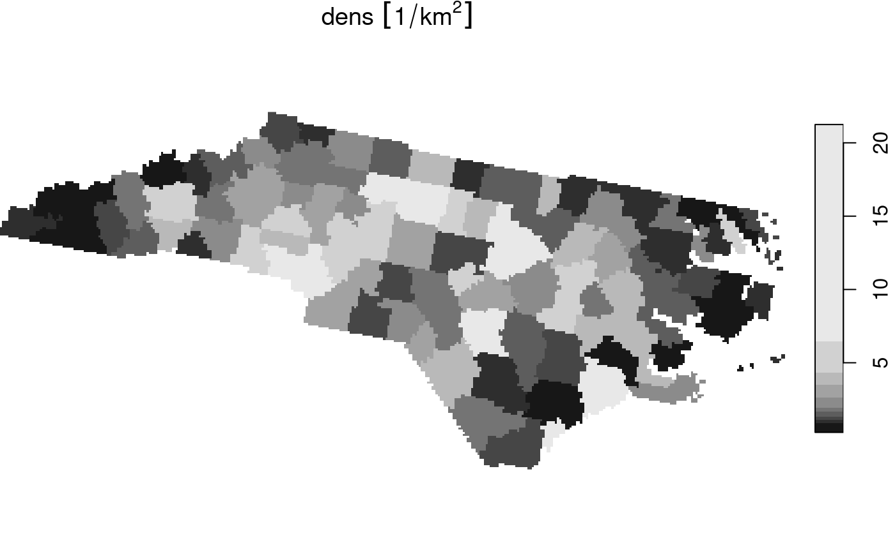

# 5. vector-raster conversions, reprojection, warping

This vignette shows how `stars` object can be moved from vector and
raster representations.

## Rasterizing an `sf` vector object

``` r
library(stars)
## Loading required package: abind
system.file("gpkg/nc.gpkg", package = "sf") %>%
  read_sf() %>%
  st_transform(32119) -> nc
nc$dens = nc$BIR79 / units::set_units(st_area(nc), km^2)
(nc.st = st_rasterize(nc["dens"], dx = 5000, dy = 5000))
## stars object with 2 dimensions and 1 attribute
## attribute(s):
##                    Min.  1st Qu. Median     Mean  3rd Qu.     Max. NA's
## dens [1/km^2] 0.2545128 1.225654 1.9322 3.345956 3.825793 21.24795 4808
## dimension(s):
##   from  to offset delta                 refsys point x/y
## x    1 162 123830  5000 NAD83 / North Carolina FALSE [x]
## y    1  61 318256 -5000 NAD83 / North Carolina FALSE [y]
plot(nc.st)
```


The algorithm used is the GDAL `rasterize` utility, all options of this
utility can be passed to `st_rasterize`. The geometry of the final
raster can be controlled by passing a target bounding box and either the
raster dimensions `nx` and `ny`, or pixel size by the `dx` and `dy`
parameters.

## Vectorizing a raster object to an `sf` object

`stars` objects can be converted into an `sf` object using `st_as_sf`.
It has a number of options, depending on whether pixels represent the
point value at the pixel center, or small square polygons with a single
value.

We will work again with the landsat-7 6-band image, but will select the
first band and round the values:

``` r
tif = system.file("tif/L7_ETMs.tif", package = "stars")
x = read_stars(tif)[, 1:50, 1:50, 1:2]
x[[1]] = round(x[[1]]/5)
```

### Polygonizing

In case raster cells reflect point values and we want to get a vector
representation of the whole field, we can draw contour lines and export
the contour sets (only available when the GDAL version is at least
2.4.0):

``` r
l =  st_contour(x, contour_lines = TRUE, breaks = 11:15)
plot(l[1], key.pos = 1, pal = sf.colors, lwd = 2, key.length = 0.8)
```


### Exporting to points

Alternatively, we can simply export all the pixels as points, and get
them either as a wide table with all bands per point, and no replicated
`POINT` geometries:

``` r
st_as_sf(x, as_points = TRUE, merge = FALSE)
## Simple feature collection with 2500 features and 2 fields
## Geometry type: POINT
## Dimension:     XY
## Bounding box:  xmin: 288790.5 ymin: 9119350 xmax: 290187 ymax: 9120747
## Projected CRS: SIRGAS 2000 / UTM zone 25S
## First 10 features:
##    L7_ETMs.tif.V1 L7_ETMs.tif.V2                 geometry
## 1              14             11 POINT (288790.5 9120747)
## 2              14             11   POINT (288819 9120747)
## 3              13             10 POINT (288847.5 9120747)
## 4              12              9   POINT (288876 9120747)
## 5              12             10 POINT (288904.5 9120747)
## 6              12             10   POINT (288933 9120747)
## 7              12             10 POINT (288961.5 9120747)
## 8              12             10   POINT (288990 9120747)
## 9              13             10 POINT (289018.5 9120747)
## 10             13             10   POINT (289047 9120747)
```

or as a long table with a single attribute and all points replicated:

``` r
st_as_sf(x, as_points = TRUE, merge = FALSE, long = TRUE)
## Simple feature collection with 5000 features and 2 fields
## Geometry type: POINT
## Dimension:     XY
## Bounding box:  xmin: 288790.5 ymin: 9119350 xmax: 290187 ymax: 9120747
## Projected CRS: SIRGAS 2000 / UTM zone 25S
## First 10 features:
##    band L7_ETMs.tif                 geometry
## 1     1          14 POINT (288790.5 9120747)
## 2     1          14   POINT (288819 9120747)
## 3     1          13 POINT (288847.5 9120747)
## 4     1          12   POINT (288876 9120747)
## 5     1          12 POINT (288904.5 9120747)
## 6     1          12   POINT (288933 9120747)
## 7     1          12 POINT (288961.5 9120747)
## 8     1          12   POINT (288990 9120747)
## 9     1          13 POINT (289018.5 9120747)
## 10    1          13   POINT (289047 9120747)
```

as we can see, an additional attribute `band` now indicates which band
is concerned.

### Exporting to polygons

Alternatively, we can export to polygons and either get a single polygon
per pixel, as in

``` r
st_as_sf(x[1], as_points = FALSE, merge = FALSE)
## Simple feature collection with 2500 features and 2 fields
## Geometry type: POLYGON
## Dimension:     XY
## Bounding box:  xmin: 288776.3 ymin: 9119336 xmax: 290201.3 ymax: 9120761
## Projected CRS: SIRGAS 2000 / UTM zone 25S
## First 10 features:
##    L7_ETMs.tif.V1 L7_ETMs.tif.V2                       geometry
## 1              14             11 POLYGON ((288776.3 9120761,...
## 2              14             11 POLYGON ((288804.8 9120761,...
## 3              13             10 POLYGON ((288833.3 9120761,...
## 4              12              9 POLYGON ((288861.8 9120761,...
## 5              12             10 POLYGON ((288890.3 9120761,...
## 6              12             10 POLYGON ((288918.8 9120761,...
## 7              12             10 POLYGON ((288947.3 9120761,...
## 8              12             10 POLYGON ((288975.8 9120761,...
## 9              13             10 POLYGON ((289004.3 9120761,...
## 10             13             10 POLYGON ((289032.8 9120761,...
```

or merge polygons that have identical pixel values;

``` r
p = st_as_sf(x, as_points = FALSE, merge = TRUE)
```

When plotted with boundaries, we see the resolved boundaries of areas
with the same pixel value:

``` r
plot(p)
```


A further option `connect8` can be set to `TRUE` to use 8 connectedness,
rather than the default 4 connectedness algorithm. In both cases, the
polygons returned will often be invalid according to the simple feature
standard, but can be made valid using `lwgeom::st_make_valid`.

## Switching between vector and raster in `stars` objects

We can convert a raster dimension to a vector dimension while keeping
other dimensions as they are in a `stars` object by

``` r
x.sf = st_xy2sfc(x, as_points = TRUE)
x.sf
## stars object with 2 dimensions and 1 attribute
## attribute(s):
##              Min. 1st Qu. Median    Mean 3rd Qu. Max.
## L7_ETMs.tif     7       9     11 11.2548      12   28
## dimension(s):
##          from   to                     refsys point
## geometry    1 2500 SIRGAS 2000 / UTM zone 25S  TRUE
## band        1    2                         NA    NA
##                                                       values
## geometry POINT (288790.5 9120747),...,POINT (290187 9119350)
## band                                                    NULL
```

which also requires setting the `as_points` arguments as in `st_as_sf`.

## Reprojecting a raster

If we accept that curvilinear rasters are rasters too, and that regular
and rectilinear grids are special cases of curvilinear grids,
reprojecting a raster is no longer a “problem”, it just recomputes new
coordinates for every raster cell, and generally results in a
curvilinear grid (that sometimes can be brought back to a regular or
rectilinear grid). If curvilinear grid cells are represented by
coordinates of the cell center, the actual shape of a grid cell gets
lost, and this may be a larger effect if grid cells are large or if the
transformation is stronger non-linear.

An example of the reprojection of the grid created above is

``` r
nc.st %>% st_transform("+proj=laea +lat_0=34 +lon_0=-60") -> nc.curv
nc.curv
## stars object with 2 dimensions and 1 attribute
## attribute(s):
##                    Min.  1st Qu. Median     Mean  3rd Qu.     Max. NA's
## dens [1/km^2] 0.2545128 1.225654 1.9322 3.345956 3.825793 21.24795 4808
## dimension(s):
##   from  to                       refsys point                         values
## x    1 162 +proj=laea +lat_0=34 +lon... FALSE [162x61] -2210936,...,-1371611
## y    1  61 +proj=laea +lat_0=34 +lon... FALSE      [162x61] 90646,...,538200
##   x/y
## x [x]
## y [y]
## curvilinear grid
plot(nc.curv, border = NA, graticule = TRUE)
```


where it should be noted that the dimensionality of the grid didn’t
change: the same set of raster cells has been replotted in the new CRS,
but now in a curvilinear grid.

## Warping a raster

Warping a raster means creating a new *regular* grid in a new CRS, based
on a (usually regular) grid in another CRS. We can do the transformation
of the previous section by first creating a target grid:

``` r
nc %>% st_transform("+proj=laea +lat_0=34 +lon_0=-60") %>% st_bbox() %>%
    st_as_stars() -> newgrid
```

and then warping the old raster to the new

``` r
nc.st %>% st_warp(newgrid) -> nc.new
nc.new 
## stars object with 2 dimensions and 1 attribute
## attribute(s):
##                    Min.  1st Qu. Median     Mean  3rd Qu.     Max.  NA's
## dens [1/km^2] 0.2545128 1.225654 1.9322 3.344844 3.825793 21.24795 36155
## dimension(s):
##   from  to   offset delta                       refsys x/y
## x    1 380 -2188108  2098 +proj=laea +lat_0=34 +lon... [x]
## y    1 171   494920 -2098 +proj=laea +lat_0=34 +lon... [y]
plot(nc.new)
```



This new object has a regular grid in the new CRS, aligned with the new
x- and y-axes.
