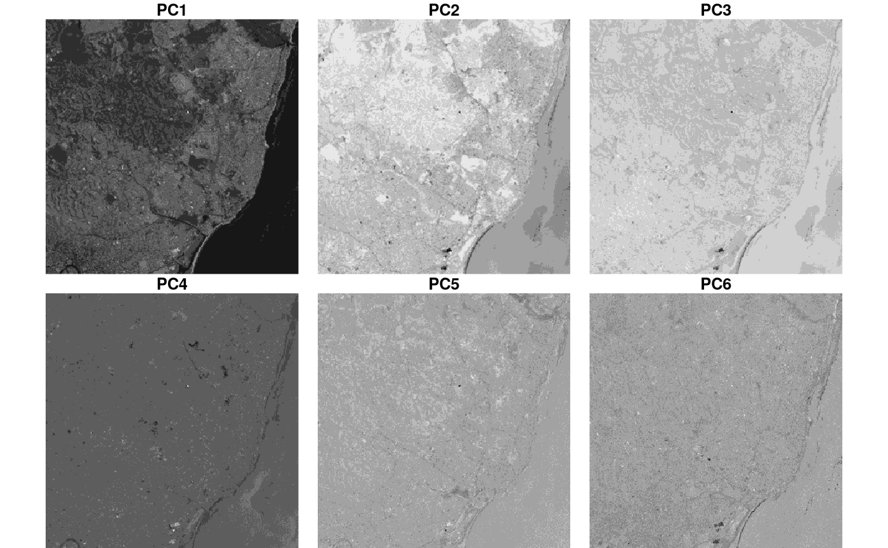
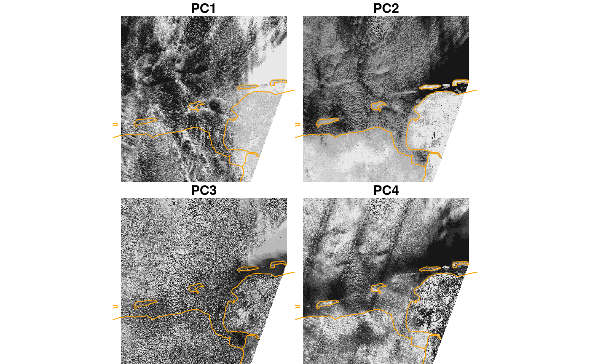
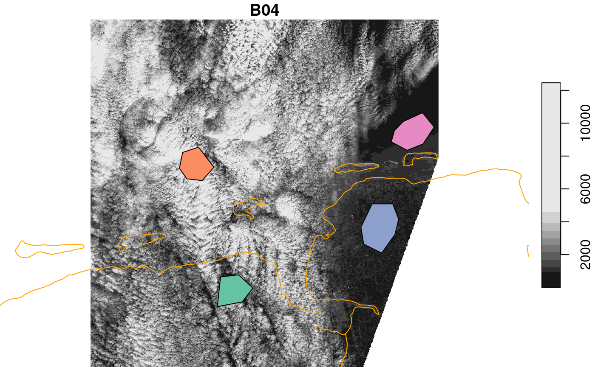
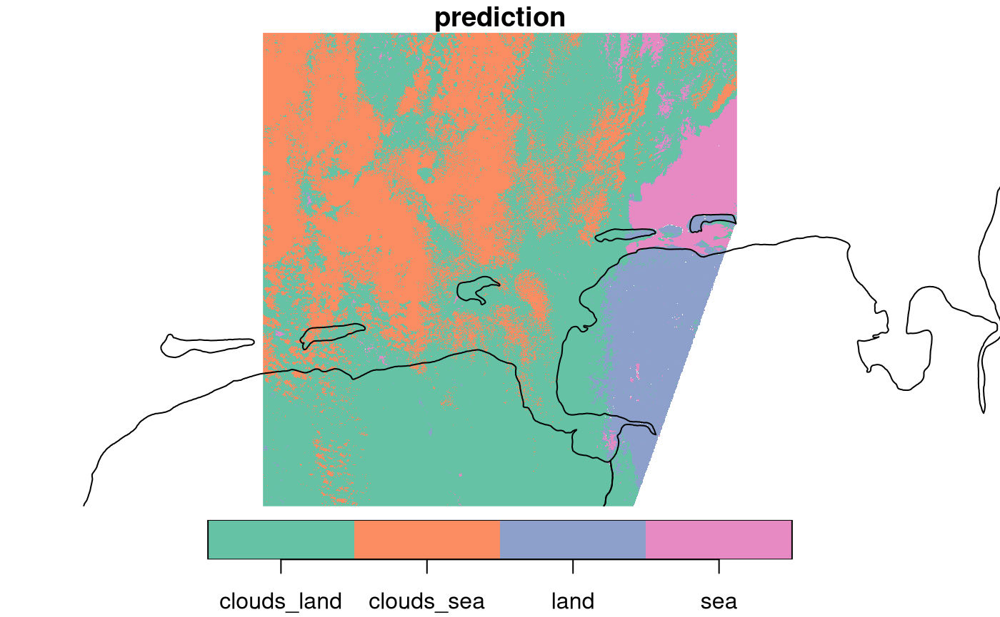

# 7. Statistical modelling with stars objects

We will first fix the random number seed, to get identical results for
procedures that involve random sampling. Remove this command if you want
the random effect in outcomes.

``` r
set.seed(131)
```

## Training and prediction with stars objects

The usual way of statistical modelling in R uses `data.frame`s (or
tibbles), and proceeds like

``` r
m = model(formula, data)
pr = predict(m, newdata)
```

where `model` is a function like `lm`, `glm`, `randomForest` etc. that
returns a classed object, such that the `predict` generic can choose the
right prediction function based on that class. `formula` looks like
`y ~ x1+x2` and specifies the dependent variable (`y`) and predictors
(`x1`, `x2`), which are found as columns in `data`. `newdata` needs to
have the predictors in its columns, and returns the predicted values for
`y` at these values for predictors.

### stars objects as data.frames

The analogy of stars objects to `data.frame` is this:

- each attribute (array) becomes a single column
- dimensions become added (index) columns

To see how this works with the 6-band example dataset, consider this:

``` r
library(stars)
## Loading required package: abind
## Loading required package: sf
## Linking to GEOS 3.12.1, GDAL 3.8.4, PROJ 9.4.0; sf_use_s2() is TRUE
l7 = system.file("tif/L7_ETMs.tif", package = "stars") %>%
  read_stars()
l7
## stars object with 3 dimensions and 1 attribute
## attribute(s):
##              Min. 1st Qu. Median     Mean 3rd Qu. Max.
## L7_ETMs.tif     1      54     69 68.91242      86  255
## dimension(s):
##      from  to  offset delta                     refsys point x/y
## x       1 349  288776  28.5 SIRGAS 2000 / UTM zone 25S FALSE [x]
## y       1 352 9120761 -28.5 SIRGAS 2000 / UTM zone 25S FALSE [y]
## band    1   6      NA    NA                         NA    NA
as.data.frame(l7) %>% head()
##          x       y band L7_ETMs.tif
## 1 288790.5 9120747    1          69
## 2 288819.0 9120747    1          69
## 3 288847.5 9120747    1          63
## 4 288876.0 9120747    1          60
## 5 288904.5 9120747    1          61
## 6 288933.0 9120747    1          61
```

We see that we get **one** single variable with the object (array) name,
and added columns with the dimension values (x, y, band). In a typical
case, we would like to have the six bands distributed over six
variables, and have a single observation (row) for each x/y pair. For
this, we *could* use
e.g. [`utils::unstack`](https://rdrr.io/r/utils/stack.html) or
`dplyr::pivot_wider` on this data.frame, but a more efficient way is to
use the dedicated `split` method for `stars` objects, which resolves a
dimension and splits it over attributes, one for each dimension value:

``` r
l7 %>% split("band") %>%
  as.data.frame() %>% 
  head()
##          x       y X1 X2 X3 X4 X5 X6
## 1 288790.5 9120747 69 56 46 79 86 46
## 2 288819.0 9120747 69 57 49 75 88 49
## 3 288847.5 9120747 63 52 45 66 75 41
## 4 288876.0 9120747 60 45 35 66 69 38
## 5 288904.5 9120747 61 52 44 76 92 60
## 6 288933.0 9120747 61 50 37 78 74 38
```

The reason that `split` is more efficient than the mentioned
alternatives is that (i) `split` does not have to match records based on
dimensions (x/y), and (ii) it works for out-of-memory (stars_proxy)
arrays, in the chunked process/write loop of
[`write_stars()`](../reference/write_stars.md). \### Predict for `stars`
objects

The pattern to obtain predictions for all pixels of a `stars` objects
is:

- use the full dataset or a sample of it to train the model, using
  [`as.data.frame()`](https://rdrr.io/r/base/as.data.frame.html)
  (possibly after a `split`)
- use `predict(star_object, model)` to predict for all pixels of
  `stars_object`, using the stars-wrapper of the `predict` method for
  `model`.
- if there is no `predict` method for `model`, provide one (see the
  `kmeans` example below)

This works both for `stars` objects (in-memory) as `stars_proxy` objects
(out-of memory). For plotting `stars_proxy` objects, downsampling is
done *before* prediction (predicting only the pixels that are shown),
full rasters can be written to disk with
[`write_stars()`](../reference/write_stars.md), which will carry out
predictions on chunks being read and written.

## models fitted for every pixel

We can run models in many different ways on array data. One way is to
run a single model to all pixels, where the model operates e.g. on the
spectral (band) or temporal dimension. An example was given [in vignette
2](https://r-spatial.github.io/stars/articles/stars2.html#plotting-with-changed-evaluation-order),
where NDVI was computed from the red and near infrared band. NDVI does
not involve estimating parameters, but reducing two bands to one.

An example where we fit a model to every pixel would be fit a time
series model to each pixel time series, and output one or more model
coefficients for each pixel; this is shown next.

### Linear regression on pixel time series

We can read in the avhrr dataset, containing only 9 days:

``` r
library(stars)
x = c("avhrr-only-v2.19810901.nc",
"avhrr-only-v2.19810902.nc",
"avhrr-only-v2.19810903.nc",
"avhrr-only-v2.19810904.nc",
"avhrr-only-v2.19810905.nc",
"avhrr-only-v2.19810906.nc",
"avhrr-only-v2.19810907.nc",
"avhrr-only-v2.19810908.nc",
"avhrr-only-v2.19810909.nc")
file_list = system.file(paste0("netcdf/", x), package = "starsdata")
y = read_stars(file_list, sub = "sst", quiet = TRUE, proxy = TRUE)
(t = st_get_dimension_values(y, 4))
## [1] 1 2 3 4 5 6 7 8 9
```

We will use a function that computes the slope of the regression line
for temperature with time. We get temperatures as a vector in the first
argument of the function supplied to `st_apply`, and have `t` already
defined. The function could look like

``` r
slope = function(x) {
  if (any(is.na(x)))
    NA_real_
  else
    coeffients(lm(x~t))[2]
}
```

but we will optimize this a bit, using `anyNA` and `lm.fit` rather than
`lm`:

``` r
slope = function(x) {
  if (anyNA(x))
    NA_real_
  else
    lm.fit(cbind(1, t), x)$coefficients[2]
}
```

The result is lazily defined by (`adrop` drops the singular dimension)

``` r
out = st_apply(adrop(y), c(1,2), slope)
```

but only *computed* by the following command, where the computations are
restricted to the pixels plotted:

``` r
plot(out, breaks = "equal", main = "9-day time trend (slope)")
## downsample set to 1
```


An interesting pattern appears (despite the very short time series!):
where SST reveals a main signal of colder when getting further from the
equator, *changes* in SST show much more fine grained structures of
areas going up, and others going down. A diverging color ramp would be a
better choice here, to distinguish positive from negative trends.

## Unsupervised learners

### Principal components

In the first example, we build principal components on the entire
dataset, because it is rather small.

``` r
tif = system.file("tif/L7_ETMs.tif", package = "stars")
r = split(read_stars(tif))
pc = prcomp(as.data.frame(r)[,-(1:2)]) # based on all data
out = predict(r, pc)
plot(merge(out), breaks = "equal", join_zlim = FALSE)
```



We see, amongst others, that PC1 picks up the difference between sea
(dark) and land, and PC2 and 3 structures in sea and coastal waters.

In the second example, we build principal components from a sample of
the entire dataset, because the entire dataset is rather large. We apply
it, using `predict`, to pixels shown in the plot (i.e. at reduced rather
than full resolution)

``` r
granule = system.file("sentinel/S2A_MSIL1C_20180220T105051_N0206_R051_T32ULE_20180221T134037.zip", 
   package = "starsdata")
s2 = paste0("SENTINEL2_L1C:/vsizip/", granule, 
"/S2A_MSIL1C_20180220T105051_N0206_R051_T32ULE_20180221T134037.SAFE/MTD_MSIL1C.xml:10m:EPSG_32632")
p = read_stars(s2, proxy = TRUE, NA_value = 0) %>%
    split()
r = st_sample(p, 1000)
pc = prcomp(na.omit(as.data.frame(r))[,-(1:2)]) # based on all data
out = predict(p, pc)
```

Before plotting this, we’ll add country borders that delineate sea,
obtained from the `mapdata` package:

``` r
bb = st_bbox(p) %>% 
  st_as_sfc() %>%
  st_transform(4326) %>%
  st_bbox()
library(maps)
library(mapdata)
m = map("worldHires", xlim = bb[c(1,3)], ylim = bb[c(2,4)], plot=F,fill=TRUE) %>%
  st_as_sfc() %>%
  st_transform(st_crs(r))
```

We plot the results with independent color ranges, so every PC is
stretched over the entire grey scale.

``` r
plt_boundary = function() plot(m, border = 'orange', add = TRUE)
plot(merge(out), hook = plt_boundary, join_zlim = FALSE)
## downsample set to 18
```



This suggests that PC1 picks up the difference cloud signal (difference
between clouds and non-clouds), PC2 the difference between sea and land
areas, and PC4 some sensor artefacts (striping in swath direction).

To compute full resolution (10000 x 10000 pixels) results and write them
to a file, use

``` r
write_stars(merge(out), "out.tif")
```

### K-means clustering

``` r
library(clue)
predict.kmeans = function(object, newdata, ...) {
    unclass(clue::cl_predict(object, newdata[, -c(1:2)], ...))
}
```

For a small dataset:

``` r
tif = system.file("tif/L7_ETMs.tif", package = "stars")
i = read_stars(tif, proxy = TRUE) %>%
    split()
nclus = 5

sam = st_sample(i, 1000)
k = kmeans(na.omit(as.data.frame(sam)[, -c(1:2)]), nclus)
out = predict(i, k)
plot(out, col = sf.colors(nclus, categorical=TRUE))
```


This seems to pick up a fair number of land cover classes: water (5),
rural (3), and densely populated (1, 2).

For the large(r) dataset:

``` r
i = read_stars(s2, proxy = TRUE, NA_value = 0) %>%
    split()
sam = st_sample(i, 1000)
k = kmeans(na.omit(as.data.frame(sam)[, -c(1:2)]), nclus)
out = predict(i, k)
plot(out, col = sf.colors(nclus, categorical=TRUE), reset = FALSE)
## downsample set to 18
plot(m, add = TRUE)
```


we see that class 1 and 3 identify with the unclouded area, 3 with land,
the other classes seem to mainly catch aspects of the cloud signal.

## Supervised learners

### Random Forest land use classification

The following example is purely for educational purposes; the classified
“land use” is just a rough approximation from what seems to be easily
visible on the image: sea, land, and areas with both but partially
covered by clouds. We opted therefore for four classes: sea, land,
clouds over sea, clouds over land.

We have polygon areas where the land use was classified, residing in a
GeoPackage file. (This file was created using QGIS, using the
instructions found
[here](https://www.qgistutorials.com/en/docs/digitizing_basics.html).)

``` r
# for all, multi-resolution, use:
bands = c("B04", "B03", "B02", "B08", "B01", "B05", "B06", "B07", "B8A", "B09", "B10", "B11", "B12")
# bands = c("B04", "B03", "B02", "B08")
s2 = paste0("/vsizip/", granule, 
"/S2A_MSIL1C_20180220T105051_N0206_R051_T32ULE_20180221T134037.SAFE/GRANULE/L1C_T32ULE_A013919_20180220T105539/IMG_DATA/T32ULE_20180220T105051_", bands, ".jp2")
r = read_stars(s2, proxy = TRUE, NA_value = 0) %>%
    setNames(bands) 
cl = read_sf(system.file("gpkg/s2.gpkg", package = "stars")) %>%
  st_transform(st_crs(r))
plot(r, reset = FALSE)
## downsample set to 8
plot(cl, add = TRUE)
plot(m, add = TRUE, border = 'orange')
```



Next, we need points, sampled inside these polygons, for which we need
to extract the satellite spectral data

``` r
pts = st_sample(cl, 1000, "regular") %>%
    st_as_sf() %>%
    st_intersection(cl)
## Warning: attribute variables are assumed to be spatially constant throughout
## all geometries
train = st_extract(r, pts)
train$use = as.factor(pts$use) # no need for join, since the order did not change
train
## Simple feature collection with 1000 features and 14 fields
## Geometry type: POINT
## Dimension:     XY
## Bounding box:  xmin: 328195.1 ymin: 5909563 xmax: 407928.8 ymax: 5970391
## Projected CRS: WGS 84 / UTM zone 32N
## First 10 features:
##     B04  B03  B02  B08  B01  B05  B06  B07  B8A  B09 B10  B11  B12
## 1   921 1139 1396 2375 1744 1180 1860 2099 2396 1006  15 1458  779
## 2   879 1136 1366 2935 1728 1246 2148 2537 2814  994  14 1669  887
## 3   870 1029 1338 1872 1694 1076 1567 1765 2042  824  14 1629  856
## 4  1016 1228 1439 3054 1789 1477 2655 3057 3427 1207  15 2220 1210
## 5  1010 1145 1449 2039 1782 1302 1724 1975 2144  860  10 1795  999
## 6  1344 1213 1475 1943 1770 1427 1684 1901 2143  863  14 2276 1365
## 7  1067 1204 1472 2348 1778 1369 2057 2306 2685 1032  17 2010 1179
## 8  1035 1144 1437 2289 1760 1299 1891 2246 2637 1042  11 1788  920
## 9   854 1047 1371 1902 1715 1146 1815 1941 2133  782  16 1568  949
## 10  941 1155 1379 2802 1689 1380 2268 2595 2976 1058  15 2012 1086
##                           x  use
## 1  POINT (394518.2 5940525) land
## 2  POINT (390045.1 5931738) land
## 3  POINT (390340.9 5929888) land
## 4    POINT (391254 5938829) land
## 5  POINT (391997.7 5937843) land
## 6  POINT (395680.9 5933296) land
## 7  POINT (388792.2 5934807) land
## 8  POINT (392185.2 5940074) land
## 9  POINT (387142.8 5936359) land
## 10 POINT (390877.6 5927178) land
```

``` r
library(randomForest)
## randomForest 4.7-1.2
## Type rfNews() to see new features/changes/bug fixes.
## 
## Attaching package: 'randomForest'
## The following object is masked from 'package:dplyr':
## 
##     combine
train = as.data.frame(train)
train$x = NULL # remove geometry
rf = randomForest(use ~ ., train) # ~ . : use all other attributes
pr = predict(r, rf)
plot(pr, reset = FALSE, key.pos = 1)
## downsample set to 8
# add country outline:
plot(m, add = TRUE)
```



This comes with the rather trivial finding that land and sea can be well
predicted when there are no clouds, and the less trivial finding that
they can be reasonably distinguished through patchy clouds of this kind.
Note that predictions of this kind are pure pixel-based: for each
prediction only the spectral bands for this pixel are considered, not
for instance of any neighboring pixels.

## Parallel processing

Some machine learning models support multithreading by default (e.g.,
`ranger` and `xgboost`), but this is not the rule. R is single-threaded,
but using appropriate packages we can easily parallelize the
calculations, which will reduce the data processing time. An example
tutorial showing step-by-step unsupervised classification using
multithreading can be found on the [R-Spatial
blog](https://r-spatial.org/r/2023/09/21/stars-parallel.html).
