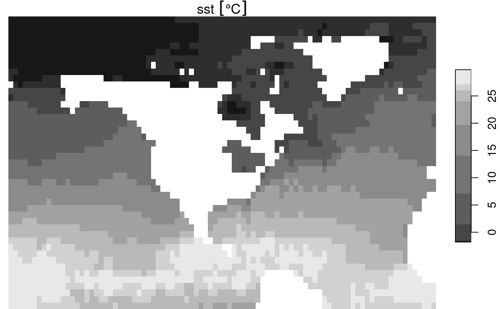

# 8. NetCDF Proxy Workflows

NetCDF data sources are available via more *and* less granular files
and/or OPeNDAP endpoints. This article demonstrates how `stars` enables
discovery, access, and processing of NetCDF data across a wide range of
such source-data organization schemes.

We’ll start with some basics using datasets included with the `stars`
installation. A call to [`read_ncdf()`](../reference/read_ncdf.md), for
a dataset smaller than the default threshold, will just read in all the
data. Below we read in and display the `reduced.nc` NetCDF file.

``` r
library(stars)
## Loading required package: abind
## Loading required package: sf
## Linking to GEOS 3.12.1, GDAL 3.8.4, PROJ 9.4.0; sf_use_s2() is TRUE
f <- system.file("nc/reduced.nc", package = "stars")
(nc <- read_ncdf(f))
## no 'var' specified, using sst, anom, err, ice
## other available variables:
##  lon, lat, zlev, time
## 0-360 longitude crossing the international date line encountered.
## Longitude coordinates will be 0-360 in output.
## Will return stars object with 16200 cells.
## No projection information found in nc file. 
##  Coordinate variable units found to be degrees, 
##  assuming WGS84 Lat/Lon.
## stars object with 4 dimensions and 4 attributes
## attribute(s):
##                Min. 1st Qu. Median       Mean 3rd Qu.  Max.  NA's
## sst [°C]      -1.80   -0.03 13.655 12.9940841 24.8125 32.97  4448
## anom [°C]     -7.95   -0.58 -0.080 -0.1847324  0.2100  2.99  4449
## err [°C]       0.11    0.16  0.270  0.2626872  0.3200  0.84  4448
## ice [percent]  0.01    0.47  0.920  0.7178118  0.9600  1.00 13266
## dimension(s):
##      from  to         offset delta         refsys point values x/y
## lon     1 180             -1     2 WGS 84 (CRS84)    NA   NULL [x]
## lat     1  90            -90     2 WGS 84 (CRS84)    NA   NULL [y]
## zlev    1   1             NA    NA             NA    NA      0    
## time    1   1 1981-12-31 UTC    NA        POSIXct  TRUE   NULL
```

Let’s assume `reduced.nc` was 10 years of hourly data, rather than 1
time step. It would be over 10GB rather than about 130KB and we would
not be able to just read it all into memory. In this case, we need a way
to read the file’s metadata such that we could iterate over it in a way
that meets the needs of our workflow objectives. This is where
`proxy = TRUE` comes in. Below, we’ll lower the option that controls
whether [`read_ncdf()`](../reference/read_ncdf.md) defaults to proxy
*and* use `proxy = TRUE` to show both ways of getting the same result.

``` r
old_options <- options("stars.n_proxy" = 100)
(nc <- read_ncdf(f, proxy = TRUE))
## no 'var' specified, using sst, anom, err, ice
## other available variables:
##  lon, lat, zlev, time
## 0-360 longitude crossing the international date line encountered.
## Longitude coordinates will be 0-360 in output.
## No projection information found in nc file. 
##  Coordinate variable units found to be degrees, 
##  assuming WGS84 Lat/Lon.
## netcdf source stars proxy object from:
## [1] "[...]/reduced.nc"
## 
## Available nc variables:
## sst
## anom
## err
## ice
## 
## dimension(s):
##      from  to         offset delta         refsys point values x/y
## lon     1 180             -1     2 WGS 84 (CRS84)    NA   NULL [x]
## lat     1  90            -90     2 WGS 84 (CRS84)    NA   NULL [y]
## zlev    1   1             NA    NA             NA    NA      0    
## time    1   1 1981-12-31 UTC    NA        POSIXct  TRUE   NULL
options(old_options)
```

The above shows that we have a NetCDF sourced stars proxy derived from
the `reduced.nc` file. We see it has four variables and their units are
displayed. The normal `stars` `dimension(s)` are available and a
`nc_request` object is also available. The `nc_request` object contains
the information needed to make requests for data according to the
dimensions of the NetCDF data source. With this information, we have
what we need to request a chunk of data that is what we want and not too
large.

``` r
(nc <- read_ncdf(f, 
                 var = "sst", 
                 ncsub = cbind(start = c(90, 45, 1 , 1), 
                              count = c(90, 45, 1, 1))))
## 0-360 longitude crossing the international date line encountered.
## Longitude coordinates will be 0-360 in output.
## Will return stars object with 4050 cells.
## No projection information found in nc file. 
##  Coordinate variable units found to be degrees, 
##  assuming WGS84 Lat/Lon.
## stars object with 4 dimensions and 1 attribute
## attribute(s):
##          Min. 1st Qu. Median     Mean 3rd Qu.  Max. NA's
## sst [°C] -1.8   -1.04     14 12.92722   25.13 29.81  757
## dimension(s):
##      from to         offset delta         refsys point values x/y
## lon     1 90            177     2 WGS 84 (CRS84)    NA   NULL [x]
## lat     1 45             -2     2 WGS 84 (CRS84)    NA   NULL [y]
## zlev    1  1             NA    NA             NA    NA      0    
## time    1  1 1981-12-31 UTC    NA        POSIXct  TRUE   NULL

plot(nc)
```



The ability to view NetCDF metadata so we can make well formed requests
against the data is useful, but the real power of a proxy object is that
we can use it in a “lazy evaluation” coding style. That is, we can do
virtual operations on the object, like subsetting with another dataset,
prior to actually accessing the data volume.

Lazy operations.

There are two kinds of lazy operations possible with `stars_proxy`
objects. Some can be applied to the `stars_proxy` object itself without
accessing underlying data. Others must be composed as a chain of calls
that will be applied when data is actually required.

Methods applied to a `stars_proxy` object:

- `[` - Nearly the same as stars_proxy
- `[[<-` - stars_proxy method works
- `print` - unique method for nc_proxy to facilitate unique workflows
- `dim` - stars_proxy method works
- `c` - stars_proxy method works
- `st_redimension` - Not sure what this entails but it might not make
  sense for nc_proxy.
- `st_mosaic` \* Calls read_stars on assembled list. Not supported for
  now.
- `st_set_bbox`

Methods that add a call to the `call_list`.

- `[<-`
- `adrop`
- `aperm`
- `is.na`
- `split`
- `st_apply`
- `predict`
- `merge`
- `st_crop`
- `drop_levels`
- `Ops` (group generic for +, -, etc.)
- `Math` (group generic for abs, sqrt, tan, etc.)
- `filter`
- `mutate`
- `tansmute`
- `select`
- `rename`
- `pull`
- `slice` \* hyperslabbing for NetCDF could be as above?
- `pull`
- `replace_na`

Methods that cause a `stars_proxy` object to be fetched and turned into
a `stars` object.

- `as.data.frame`
- `plot`
- `st_as_stars`
- `aggregate`
- `st_dimensions<-` \* <https://github.com/r-spatial/stars/issues/494>
- `hist`
- `st_downsample`
- `st_sample`
- `st_as_sf`
- `write_stars`
